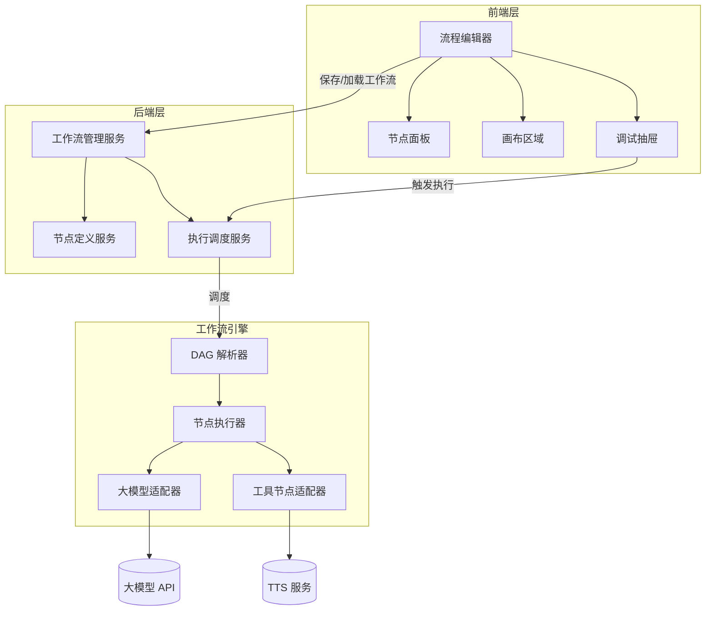
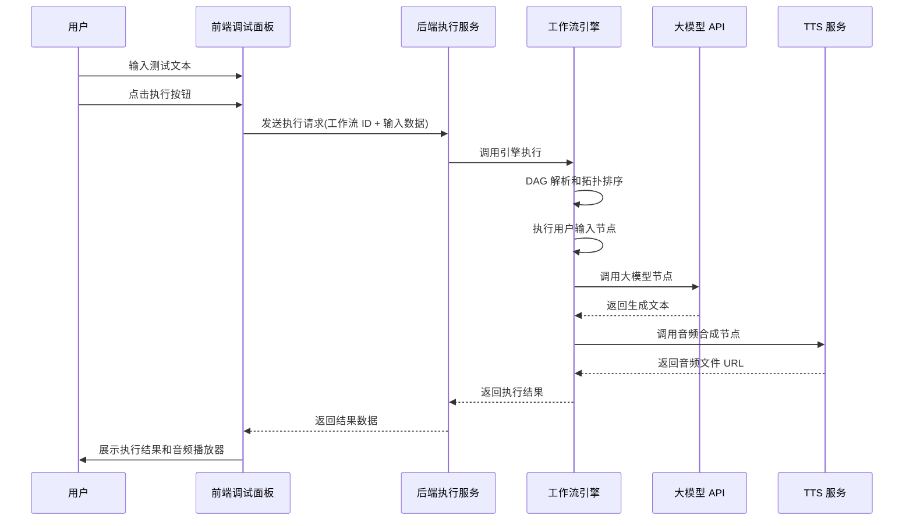
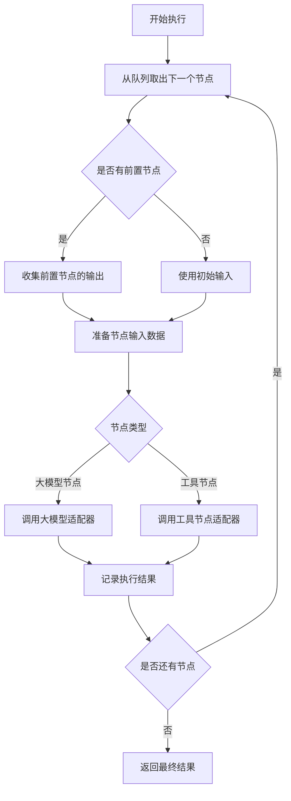

# AI Agent 流图执行面板 - 设计文档

## 一、项目概述

### 1.1 项目定位

PaiAgent 是一个企业级的可视化 AI 工作流编排平台,旨在通过低代码的方式让用户能够快速构建、调试和执行 AI 处理流程。用户通过拖拽节点的方式组合大模型和工具节点,构建自定义的 AI Agent 工作流。

### 1.2 核心价值

- **降低使用门槛**: 可视化编排替代代码编写,业务人员也能快速构建 AI 流程
- **灵活的流程组合**: 支持多个大模型节点和工具节点的自由组合
- **即时调试反馈**: 内置调试面板,实时查看每个节点的执行结果
- **可扩展架构**: 支持自定义节点类型的扩展

### 1.3 典型使用场景

用户在流程编辑器中创建一个"AI 播客生成"工作流:
1. 用户在调试面板输入一段文字主题
2. 文字经过大模型节点处理,生成播客脚本内容
3. 脚本内容传递给超拟人音频合成工具节点
4. 最终输出音频文件供用户播放

## 二、系统架构设计

### 2.1 整体架构

系统采用前后端分离架构,由三个核心模块组成:



### 2.2 技术选型

#### 前端技术栈
- 框架: React 18 + TypeScript
- 构建工具: Vite
- 流程图引擎: ReactFlow
- UI 组件库: Ant Design + Tailwind CSS
- 状态管理: Zustand 或 Redux Toolkit
- HTTP 客户端: Axios

#### 后端技术栈
- 框架: Spring Boot 3.x
- 语言: Java 21
- 构建工具: Maven
- 数据库: MySQL 8.0
- ORM: MyBatis-Plus
- API 文档: SpringDoc OpenAPI

#### 工作流引擎
- 自研轻量级 DAG 引擎
- 节点编排和执行调度
- 支持同步执行模式

### 2.3 模块职责划分

#### 前端模块
- **流程编辑器**: 负责可视化流程的创建、编辑和展示
- **节点面板**: 提供可拖拽的节点库(大模型节点、工具节点)
- **画布区域**: 承载节点布局和连线操作
- **调试抽屉**: 提供工作流测试入口和执行结果展示

#### 后端模块
- **工作流管理服务**: 负责工作流的增删改查和持久化
- **节点定义服务**: 管理节点类型的元数据和配置
- **执行调度服务**: 接收执行请求,调用工作流引擎

#### 工作流引擎模块
- **DAG 解析器**: 将工作流配置解析为有向无环图
- **节点执行器**: 按拓扑顺序执行节点
- **大模型适配器**: 封装各类大模型 API 调用(OpenAI、DeepSeek 等)
- **工具节点适配器**: 封装工具节点的执行逻辑(音频合成等)

## 三、核心功能设计

### 3.1 流程编辑器

#### 3.1.1 节点面板设计

左侧节点面板分为两个分类:

**大模型节点分类**
- OpenAI 节点
- DeepSeek 节点
- 通义千问节点
- 其他可扩展的大模型节点

**工具节点分类**
- 超拟人音频合成节点
- 其他可扩展的工具节点

每个节点包含以下元数据:
- 节点类型标识
- 节点显示名称
- 节点图标
- 输入参数定义
- 输出参数定义

#### 3.1.2 画布区域设计

画布采用 ReactFlow 实现,支持以下交互:
- 从左侧面板拖拽节点到画布
- 节点之间通过连线建立数据流关系
- 节点可自由移动和删除
- 连线支持删除和重连
- 画布支持缩放和平移

**预置节点**

画布中预置以下固定节点:
- **用户输入节点**: 工作流的起点,接收调试面板的输入文本
- **结束节点**: 工作流的终点,输出最终结果

**节点配置**

每个节点支持配置面板,用户点击节点后右侧展开配置项:
- 大模型节点: API Key、模型名称、提示词模板、温度参数等
- 工具节点: 工具特定的配置参数(如音频合成的音色、语速等)

#### 3.1.3 数据流设计

节点之间通过连线传递数据,数据流遵循以下规则:
- 每个节点可以有多个输入和多个输出
- 数据以 JSON 格式在节点间传递
- 上游节点的输出作为下游节点的输入
- 节点可以引用上游节点的输出字段

### 3.2 调试功能

#### 3.2.1 调试抽屉设计

调试抽屉位于页面右侧,可通过按钮展开和收起,包含以下区域:

**输入区**
- 多行文本输入框,用户输入测试文本
- 执行按钮,触发工作流执行

**执行状态区**
- 显示当前执行状态(等待中、执行中、已完成、失败)
- 显示执行进度(已完成节点数/总节点数)

**结果展示区**
- 每个节点的执行结果按时序展示
- 节点名称、执行耗时、输入输出数据
- 最终节点的音频播放器(支持音频播放和下载)

**日志区**
- 展示执行过程中的详细日志
- 错误信息高亮显示

#### 3.2.2 执行流程

调试执行的完整流程:



### 3.3 工作流管理

#### 3.3.1 工作流保存

用户编辑完成后,可将工作流保存到数据库,保存内容包括:
- 工作流名称和描述
- 节点列表(节点 ID、类型、位置坐标、配置参数)
- 连线列表(源节点 ID、目标节点 ID、端口信息)
- 创建时间和更新时间

#### 3.3.2 工作流加载

用户可从工作流列表中选择已保存的工作流,加载到画布进行编辑或调试。

### 3.4 节点类型扩展机制

系统支持自定义节点类型的扩展,扩展方式:

**前端扩展**
- 在节点面板注册新节点类型
- 定义节点的 UI 渲染组件
- 定义节点的配置表单

**后端扩展**
- 实现节点执行器接口
- 定义节点的输入输出参数结构
- 注册节点类型到节点工厂

## 四、数据模型设计

### 4.1 工作流数据模型

| 字段名 | 类型 | 说明 |
|--------|------|------|
| id | Long | 工作流主键 ID |
| name | String | 工作流名称 |
| description | String | 工作流描述 |
| flow_data | JSON | 工作流配置数据(节点和连线) |
| created_at | Timestamp | 创建时间 |
| updated_at | Timestamp | 更新时间 |

### 4.2 节点定义数据模型

| 字段名 | 类型 | 说明 |
|--------|------|------|
| id | Long | 节点定义主键 ID |
| node_type | String | 节点类型标识 |
| display_name | String | 显示名称 |
| category | String | 节点分类(LLM/TOOL) |
| icon | String | 节点图标 |
| input_schema | JSON | 输入参数 JSON Schema |
| output_schema | JSON | 输出参数 JSON Schema |
| config_schema | JSON | 配置参数 JSON Schema |

### 4.3 执行记录数据模型

| 字段名 | 类型 | 说明 |
|--------|------|------|
| id | Long | 执行记录主键 ID |
| flow_id | Long | 工作流 ID |
| input_data | JSON | 输入数据 |
| output_data | JSON | 输出数据 |
| status | String | 执行状态(SUCCESS/FAILED) |
| node_results | JSON | 每个节点的执行结果 |
| error_message | String | 错误信息 |
| duration | Integer | 执行耗时(毫秒) |
| executed_at | Timestamp | 执行时间 |

### 4.4 工作流配置数据结构

工作流的 flow_data 字段存储的 JSON 结构:

```
{
  "nodes": [
    {
      "id": "节点唯一标识",
      "type": "节点类型",
      "position": {
        "x": "画布 x 坐标",
        "y": "画布 y 坐标"
      },
      "data": {
        "配置参数键": "配置参数值"
      }
    }
  ],
  "edges": [
    {
      "id": "连线唯一标识",
      "source": "源节点 ID",
      "target": "目标节点 ID",
      "sourceHandle": "源节点输出端口",
      "targetHandle": "目标节点输入端口"
    }
  ]
}
```

## 五、工作流引擎设计

### 5.1 DAG 解析器

**职责**: 将工作流配置解析为可执行的有向无环图

**解析流程**:
1. 读取节点列表和连线列表
2. 构建节点依赖关系图
3. 检测循环依赖(如存在则抛出异常)
4. 执行拓扑排序,生成节点执行顺序

**输出**: 有序的节点执行队列

### 5.2 节点执行器

**职责**: 按照拓扑顺序依次执行节点

**执行流程**:



**异常处理**:
- 节点执行失败时,记录错误信息并终止整个工作流
- 将失败节点的错误信息返回给调用方

### 5.3 大模型适配器

**职责**: 封装各类大模型 API 的调用逻辑

**支持的大模型**:
- OpenAI(GPT-3.5、GPT-4 系列)
- DeepSeek
- 通义千问

**适配器接口**:

输入参数:
- API Key
- 模型名称
- 提示词(可包含变量占位符)
- 温度参数
- 最大 Token 数
- 上游节点的输出数据(用于填充提示词变量)

输出参数:
- 生成的文本内容
- 消耗的 Token 数
- 响应时间

**提示词变量替换机制**:
- 提示词中使用占位符引用上游节点输出,如: {{节点名称.输出字段}}
- 执行时动态替换为实际值

### 5.4 工具节点适配器

**职责**: 封装工具节点的执行逻辑

**超拟人音频合成节点**:

输入参数:
- 待合成的文本内容(来自大模型节点输出)
- 音色选择
- 语速设置
- 音量设置
- TTS 服务的 API Key

输出参数:
- 音频文件 URL
- 音频时长
- 文件大小

**执行逻辑**:
1. 接收上游节点输出的文本
2. 调用第三方 TTS 服务 API(如 Azure TTS、阿里云 TTS)
3. 接收合成的音频数据
4. 将音频文件存储到本地或云存储
5. 返回音频文件的访问 URL

## 六、接口设计

### 6.1 用户认证接口

#### 用户登录

- 路径: POST /api/auth/login
- 请求体:
  - username: 用户名
  - password: 密码
- 响应:
  - success: 登录是否成功
  - message: 提示信息
  - token: 访问令牌(登录成功时返回)
  - user: 用户信息(username)

#### 用户登出

- 路径: POST /api/auth/logout
- 请求头:
  - Authorization: Bearer {token}
- 响应:
  - success: 登出是否成功

#### 获取当前用户信息

- 路径: GET /api/auth/current
- 请求头:
  - Authorization: Bearer {token}
- 响应:
  - username: 当前登录用户名
  - authenticated: 是否已认证

### 6.2 工作流管理接口

#### 保存工作流

- 路径: POST /api/workflows
- 请求体:
  - name: 工作流名称
  - description: 工作流描述
  - flow_data: 工作流配置 JSON
- 响应:
  - id: 工作流 ID
  - created_at: 创建时间

#### 查询工作流列表

- 路径: GET /api/workflows
- 响应: 工作流列表(id、name、description、updated_at)

#### 获取工作流详情

- 路径: GET /api/workflows/{id}
- 响应: 完整的工作流数据(包含 flow_data)

#### 更新工作流

- 路径: PUT /api/workflows/{id}
- 请求体: 与保存工作流相同
- 响应: 更新后的工作流数据

#### 删除工作流

- 路径: DELETE /api/workflows/{id}
- 响应: 删除成功状态

### 6.3 节点定义接口

#### 查询节点类型列表

- 路径: GET /api/node-types
- 响应: 所有可用的节点类型定义(包含元数据和配置 Schema)

### 6.4 工作流执行接口

#### 执行工作流

- 路径: POST /api/workflows/{id}/execute
- 请求体:
  - input_data: 用户输入的文本
- 响应:
  - execution_id: 执行记录 ID
  - status: 执行状态
  - node_results: 每个节点的执行结果数组
  - output_data: 最终输出数据(音频 URL 等)
  - duration: 执行耗时

**节点结果结构**:
- node_id: 节点 ID
- node_name: 节点名称
- status: 节点执行状态(SUCCESS/FAILED)
- input: 节点输入数据
- output: 节点输出数据
- duration: 节点执行耗时
- error: 错误信息(如有)

## 七、用户界面设计

### 7.1 登录页面

**页面布局**
- 居中显示登录表单
- 标题: PaiAgent - AI Agent 流图执行面板

**表单内容**
- 用户名输入框(默认填充 admin)
- 密码输入框(密码类型)
- 登录按钮

**交互逻辑**
- 点击登录按钮,发送登录请求
- 登录成功后将返回的 Token 存储到 localStorage
- 跳转到主页面
- 登录失败显示错误提示

### 7.2 主页面布局

整体布局采用三栏式结构:

```
+----------------------------------------------------------+
| 顶部工具栏(保存、加载、执行、登出)                           |
+------------+----------------------------------+------------+
| 左侧面板    | 中间画布区域                      | 右侧调试   |
| (节点库)   | (流程编辑器)                      | 抽屉       |
| 200px     |                                  | 350px      |
|           |                                  | (可收起)   |
|           |                                  |            |
|           |                                  |            |
|           |                                  |            |
+------------+----------------------------------+------------+
```

**顶部工具栏新增**
- 右上角显示当前用户名(admin)
- 登出按钮,点击后清除 localStorage 中的 Token 并返回登录页

### 7.3 左侧节点面板

**大模型节点分类**
- 每个节点显示图标和名称
- 支持拖拽到画布

**工具节点分类**
- 超拟人音频合成节点
- 支持拖拽到画布

### 7.4 中间画布区域

**预置节点**
- 用户输入节点(起始节点,固定在左侧)
- 结束节点(终止节点,固定在右侧)

**用户添加的节点**
- 大模型节点(如 OpenAI、DeepSeek)
- 工具节点(如音频合成)

**交互功能**
- 节点拖拽和移动
- 节点间连线
- 删除节点和连线
- 点击节点显示配置面板

**节点样式**
- 节点包含图标、名称和输入/输出端口
- 连线用箭头表示数据流方向
- 执行时高亮当前正在执行的节点

### 7.5 右侧调试抽屉

**输入区域**
- 标签: "输入测试文本"
- 多行文本框(高度 100px)
- 执行按钮

**状态指示器**
- 显示: 等待中 / 执行中 / 已完成 / 失败
- 进度条: 已完成节点数 / 总节点数

**结果展示区域**
- 折叠面板,每个节点一个面板项
- 展开后显示:节点输入、节点输出、执行耗时

**音频播放器**
- 仅在最终节点执行完成后显示
- 音频播放控件(播放、暂停、进度条)
- 下载音频按钮

**日志区域**
- 滚动文本框,显示执行日志
- 错误信息用红色高亮

### 7.6 节点配置面板

点击画布中的节点后,在节点右侧或弹窗中显示配置面板:

**大模型节点配置**
- API Key 输入框
- 模型选择下拉框
- 提示词模板文本框(支持变量占位符)
- 温度滑块(0-1)
- 最大 Token 数输入框

**音频合成节点配置**
- TTS API Key 输入框
- 音色选择下拉框
- 语速滑块(0.5-2.0)
- 音量滑块(0-100)

## 八、异常处理策略

### 8.1 前端异常

- **网络请求失败**: 显示错误提示,引导用户重试
- **工作流验证失败**: 保存前检查是否存在孤立节点或循环依赖,给出明确错误提示
- **节点配置缺失**: 执行前检查必填配置项,未填写则高亮提示

### 8.2 后端异常

- **工作流解析失败**: 返回具体的错误原因(如循环依赖的节点 ID)
- **节点执行超时**: 设置超时时间(如 60 秒),超时后终止执行并返回错误
- **大模型 API 调用失败**: 捕获异常,记录错误信息并返回给前端
- **TTS 服务调用失败**: 捕获异常,记录错误信息并返回给前端

### 8.3 数据验证

- **输入数据验证**: 检查用户输入是否为空,长度是否超限
- **节点配置验证**: 检查 API Key 格式,参数范围是否合法
- **工作流结构验证**: 确保至少包含用户输入节点和结束节点

## 九、性能优化策略

### 9.1 前端优化

- **虚拟化渲染**: 当节点数量超过 100 个时,使用虚拟滚动优化画布渲染性能
- **防抖和节流**: 节点拖拽、画布缩放等高频操作使用防抖或节流
- **懒加载**: 工作流列表采用分页加载

### 9.2 后端优化

- **数据库索引**: 在工作流表的 created_at、updated_at 字段建立索引
- **连接池管理**: 合理配置数据库连接池大小
- **异步日志**: 使用异步日志记录,避免阻塞主线程

### 9.3 大模型调用优化

- **请求超时控制**: 设置合理的超时时间,避免长时间等待
- **API Key 管理**: 支持多个 API Key 轮询使用,避免单个 Key 限流

## 十、安全性设计

### 10.1 API Key 保护

- **加密存储**: 用户配置的 API Key 在数据库中加密存储
- **前端脱敏**: 前端展示时仅显示部分字符(如 sk-***xyz)

### 10.2 输入验证

- **长度限制**: 限制用户输入文本的最大长度(如 10000 字符)
- **特殊字符过滤**: 防止 SQL 注入和 XSS 攻击

### 10.3 用户认证

- **认证方式**: 基于拦截器的简单认证机制
- **默认账户**: 用户名 admin,密码 123(硬编码在后端)
- **本地使用**: 仅支持单用户本地使用,无需注册功能
- **登录验证**: 登录成功后生成 Token 存储在前端 localStorage,后续请求在 Header 中携带 Token
- **Token 管理**: Token 可以是简单的 UUID,后端使用 Map 或缓存存储 Token 与用户的映射关系

### 10.4 接口鉴权

- **拦截器实现**: 自定义拦截器拦截所有接口(除登录接口外)
- **Token 校验**: 从请求 Header 中获取 Token,验证是否存在且有效
- **未认证处理**: Token 无效或不存在时返回 401 状态码
- **CORS 配置**: 配置允许的跨域来源
- **请求频率限制**: 对执行接口实施限流,防止恶意调用

## 十一、扩展性设计

### 11.1 节点类型扩展

系统预留节点扩展接口,后续可快速添加新的节点类型:
- 文本处理工具节点(分词、摘要、翻译等)
- 数据源节点(数据库查询、API 调用等)
- 输出节点(邮件发送、文件保存等)

### 11.2 工作流引擎扩展

- **异步执行支持**: 当前为同步执行,后续可扩展为异步任务队列模式
- **并行执行支持**: 当多个节点无依赖关系时,支持并行执行提升性能
- **条件分支支持**: 支持基于条件的分支流程

### 11.3 多租户支持

当前设计为单用户模式,后续可扩展为多租户架构:
- 增加用户认证和权限管理
- 工作流数据按用户隔离
- 资源配额管理

## 十二、实施计划

### 12.1 开发阶段划分

**第一阶段: 基础框架搭建**
- 前端项目初始化(React + Vite + ReactFlow)
- 后端项目初始化(Spring Boot + MySQL)
- 数据库表结构设计和创建

**第二阶段: 工作流引擎开发**
- DAG 解析器实现
- 节点执行器实现
- 大模型适配器实现(优先支持 OpenAI)

**第三阶段: 前端编辑器开发**
- 节点面板开发
- 画布区域开发(基于 ReactFlow)
- 节点配置面板开发
- 工作流保存和加载功能

**第四阶段: 调试功能开发**
- 调试抽屉 UI 开发
- 执行接口联调
- 结果展示和日志输出

**第五阶段: 工具节点开发**
- 超拟人音频合成节点实现
- 音频播放器集成

**第六阶段: 测试和优化**
- 单元测试和集成测试
- 性能优化
- 用户体验优化

### 12.2 环境要求

**开发环境**
- JDK 21
- Node.js 18+
- MySQL 8.0+
- Maven 3.8+

**IDE 推荐**
- 后端: IntelliJ IDEA
- 前端: VS Code

### 12.3 技术风险和应对

**风险 1: ReactFlow 学习曲线**
- 应对: 提前阅读官方文档和示例,建立 Demo 验证可行性

**风险 2: 大模型 API 调用不稳定**
- 应对: 增加重试机制和超时控制,记录详细错误日志

**风险 3: DAG 引擎实现复杂度**
- 应对: 参考成熟的工作流引擎设计(如 Apache Airflow),采用拓扑排序算法

**风险 4: 音频合成服务选型**
- 应对: 优先选择稳定的云服务(Azure、阿里云),预留接口支持切换

## 十三、验收标准

### 13.1 功能验收

- 用户可以使用默认账户(admin/123)登录系统
- 未登录用户访问主页面时自动跳转到登录页
- 登录后可以从左侧面板拖拽节点到画布
- 用户可以在节点间建立连线
- 用户可以配置节点参数(API Key、提示词等)
- 用户可以保存和加载工作流
- 用户可以在调试面板输入文本并执行工作流
- 执行成功后可以看到每个节点的结果
- 最终可以播放和下载生成的音频文件
- 用户可以正常登出系统

### 13.2 性能验收

- 画布渲染流畅度: 50 个节点以内无明显卡顿
- 工作流执行响应时间: 单个大模型调用控制在 10 秒内
- 接口响应时间: 除执行接口外,其他接口响应时间 < 1 秒

### 13.3 稳定性验收

- 异常场景处理: API Key 错误、网络超时等异常有明确提示
- 数据持久化: 工作流保存后可正常加载
- 并发测试: 支持至少 10 个并发执行请求
