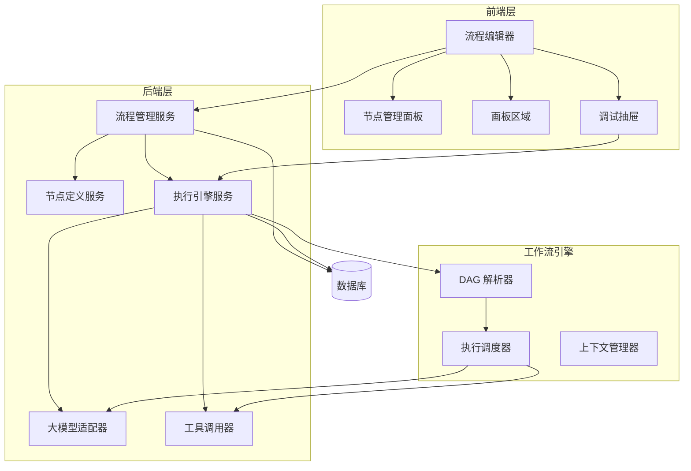
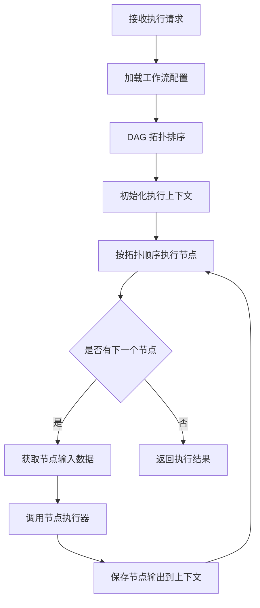
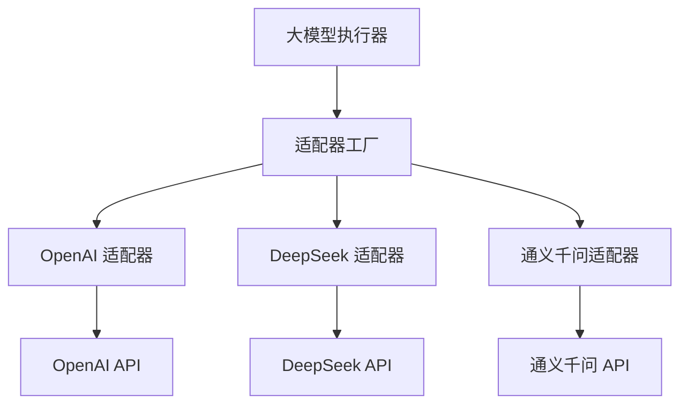
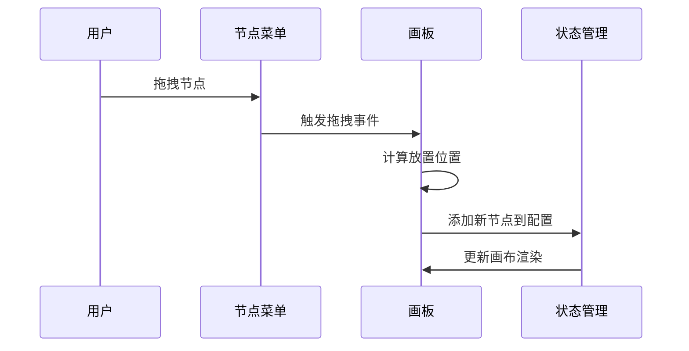
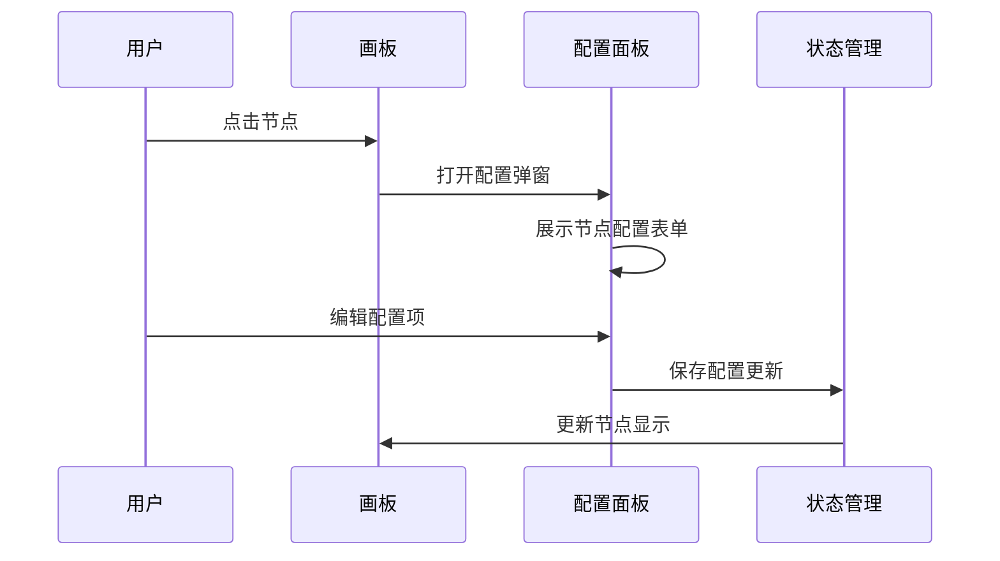
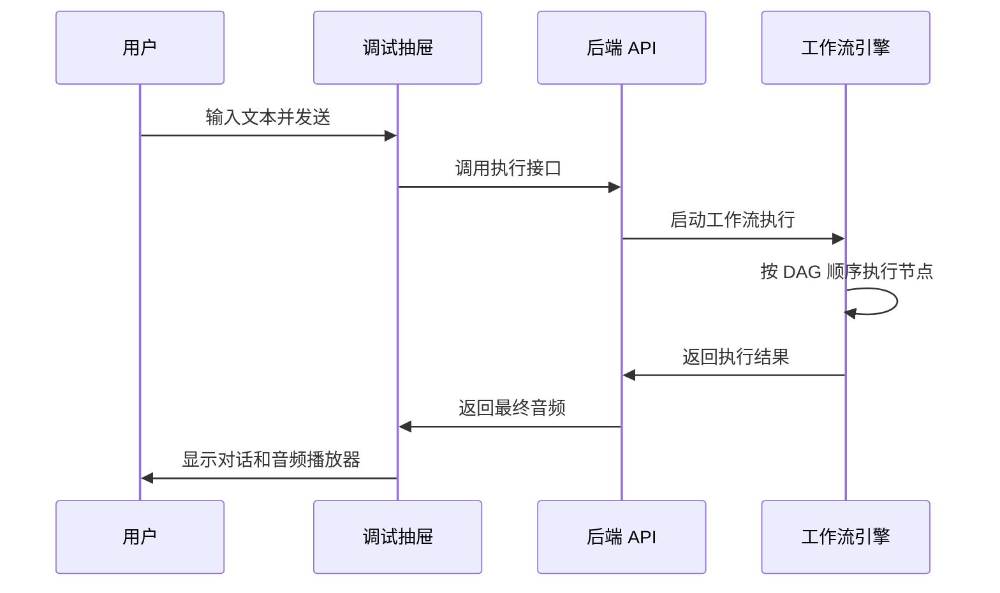

# AI Agent 流图执行面板 - 系统设计文档

## 1. 项目概述

### 1.1 项目目标
构建一个可视化的 AI Agent 工作流编排与执行平台,用户通过拖拽方式组合大模型节点和工具节点,构建自定义的 AI 处理流程,并支持实时调试和执行。

### 1.2 核心价值
- 降低 AI 应用开发门槛,无需编码即可构建复杂的 AI 处理流程
- 支持多种大模型厂商灵活接入
- 提供可视化调试能力,快速验证流程效果
- 通过工作流引擎实现节点间的数据流转和状态管理

### 1.3 技术选型

| 技术领域 | 选型方案 | 说明 |
|---------|---------|------|
| 前端框架 | React 18 + TypeScript | 组件化开发,类型安全 |
| 后端框架 | Spring Boot 3.x | 成熟的企业级框架,生态丰富 |
| 工作流引擎 | 自研 DAG 引擎 | 轻量级,支持节点编排和执行 |
| 数据存储 | MySQL/PostgreSQL | 存储工作流配置和执行记录 |
| 流程图渲染 | ReactFlow/X6 | 可视化流程编辑器 |
| 大模型接入 | 多厂商 API 适配 | 支持 OpenAI、DeepSeek、通义千问等 |

## 2. 系统架构设计

### 2.1 整体架构

系统采用前后端分离架构,包含三个核心模块:



### 2.2 分层设计

| 层次 | 职责 | 主要组件 |
|-----|------|---------|
| 展现层 | 用户交互、流程可视化编辑 | React 组件、ReactFlow 画布 |
| 应用层 | 业务逻辑处理、API 服务 | Controller、Service |
| 引擎层 | 工作流解析、节点调度执行 | DAG 引擎、执行器 |
| 集成层 | 外部服务调用适配 | 大模型适配器、工具适配器 |
| 数据层 | 数据持久化 | Repository、数据库 |

## 3. 核心功能设计

### 3.1 流程编辑器

#### 3.1.1 左侧节点菜单

节点菜单分为两类:

**基础节点**
- 大模型节点:调用 LLM API 进行文本生成、对话等

**工具节点**
- 超拟人音频合成工具:将文本转换为高质量语音
- 预留扩展:支持后续添加更多工具节点

每个节点包含元信息:

| 属性 | 说明 |
|-----|------|
| 节点类型 | 大模型、工具等 |
| 节点名称 | 显示名称 |
| 图标 | 节点图标标识 |
| 输入参数 | 节点所需输入参数定义 |
| 输出参数 | 节点输出参数定义 |
| 配置项 | 节点特有配置(如模型选择、参数设置) |

#### 3.1.2 画板区域

画板是流程编排的核心区域,支持以下交互:

**节点操作**
- 从左侧菜单拖拽节点到画板
- 点击节点进行配置编辑
- 删除、复制节点
- 节点之间连线建立数据流

**系统内置节点**

| 节点名称 | 节点类型 | 说明 |
|---------|---------|------|
| 开始节点 | 系统节点 | 工作流入口,接收用户输入 |
| 大模型节点 | 业务节点 | 调用大模型进行文本处理 |
| 超拟人音频合成节点 | 工具节点 | 将文本转为音频 |
| 结束节点 | 系统节点 | 工作流出口,返回最终结果 |

**画板功能**
- 缩放、平移画布
- 自动布局优化
- 连线校验(类型匹配检查)
- 保存流程配置

#### 3.1.3 调试抽屉

调试抽屉用于测试工作流执行效果:

**交互流程**
1. 用户点击"调试"按钮打开抽屉
2. 在输入框输入测试文本
3. 点击"发送"触发工作流执行
4. 实时显示执行过程和节点状态
5. 展示最终音频结果,支持播放

**显示内容**
- 对话历史记录(用户输入、Agent 回复)
- 音频播放器(显示生成的音频)
- 执行日志(可选,显示节点执行详情)
- 清空对话、取消执行等操作

### 3.2 节点定义与配置

#### 3.2.1 大模型节点

**节点配置项**

| 配置项 | 说明 | 类型 |
|-------|------|------|
| 模型厂商 | OpenAI、DeepSeek、通义千问等 | 下拉选择 |
| 模型名称 | 具体模型(如 gpt-4、deepseek-chat) | 下拉选择 |
| 系统提示词 | 设定 AI 角色和行为 | 文本输入 |
| 温度参数 | 控制输出随机性(0-1) | 滑块 |
| 最大 Token | 限制输出长度 | 数字输入 |

**输入输出**

| 方向 | 参数名 | 类型 | 说明 |
|-----|-------|------|------|
| 输入 | input | 文本 | 用户输入或上游节点输出 |
| 输出 | output | 文本 | 大模型生成的文本 |

#### 3.2.2 超拟人音频合成节点

**节点配置项**

| 配置项 | 说明 | 类型 |
|-------|------|------|
| 音色选择 | 不同的语音音色(vcn、text、speed 等) | 下拉选择 |
| 语速 | 控制播放速度 | 滑块 |
| 音量 | 控制音量大小 | 滑块 |

**输入输出**

| 方向 | 参数名 | 类型 | 说明 |
|-----|-------|------|------|
| 输入 | text | 文本 | 待合成的文本内容 |
| 输入 | vcn | 文本 | 音色标识 |
| 输入 | speed | 数字 | 语速参数 |
| 输出 | audio_url | URL | 生成的音频文件地址 |
| 输出 | code | 整数 | 状态码 |
| 输出 | message | 文本 | 状态消息 |
| 输出 | sid | 文本 | 会话标识 |
| 输出 | data | 对象 | 额外数据 |

### 3.3 工作流引擎设计

#### 3.3.1 DAG 模型

工作流采用有向无环图(DAG)模型:

**节点定义**
- 节点 ID:唯一标识
- 节点类型:大模型、工具、系统节点
- 节点配置:节点特定的参数配置
- 输入映射:定义输入数据来源(上游节点输出、全局变量)
- 输出定义:定义节点输出的数据结构

**边定义**
- 源节点 ID
- 目标节点 ID
- 源输出字段:源节点的哪个输出
- 目标输入字段:映射到目标节点的哪个输入

**流程结构约束**
- 必须有且仅有一个开始节点
- 必须有至少一个结束节点
- 不允许出现环路
- 所有节点必须可达(从开始节点出发能到达)

#### 3.3.2 执行引擎

**执行流程**



**执行策略**

| 策略 | 说明 |
|-----|------|
| 顺序执行 | 按拓扑排序依次执行节点 |
| 数据驱动 | 节点输入数据就绪时才执行 |
| 错误处理 | 节点执行失败时终止流程,返回错误信息 |
| 超时控制 | 单节点和整体流程设置超时时间 |

**执行上下文**

执行上下文用于存储流程执行过程中的数据:

| 数据类型 | 说明 |
|---------|------|
| 用户输入 | 开始节点接收的初始输入 |
| 节点输出 | 每个节点执行后的输出数据 |
| 全局变量 | 流程级别的共享变量 |
| 执行状态 | 流程和节点的执行状态 |

#### 3.3.3 节点执行器

每种节点类型对应一个执行器:

**执行器接口定义**

每个执行器需要实现:
- 接收节点配置和输入数据
- 执行节点逻辑
- 返回节点输出数据
- 处理异常情况

**大模型执行器**
- 根据节点配置选择对应的大模型适配器
- 构造大模型 API 请求参数
- 调用大模型 API
- 解析响应结果
- 返回标准化输出

**工具执行器**
- 根据工具类型调用对应的工具服务
- 传递输入参数
- 获取工具执行结果
- 返回标准化输出

### 3.4 大模型适配器

#### 3.4.1 适配器架构

采用适配器模式统一不同大模型厂商的 API 差异:



#### 3.4.2 适配器接口

所有适配器实现统一接口:

**输入参数**

| 参数 | 说明 |
|-----|------|
| 模型名称 | 具体的模型标识 |
| 系统提示词 | 系统角色设定 |
| 用户输入 | 用户消息内容 |
| 温度参数 | 控制随机性 |
| 最大 Token | 限制输出长度 |
| API 密钥 | 厂商 API 认证密钥 |

**输出结果**

| 字段 | 说明 |
|-----|------|
| 文本内容 | 大模型生成的文本 |
| Token 消耗 | 本次请求消耗的 Token 数 |
| 模型信息 | 实际使用的模型版本 |
| 请求 ID | 厂商返回的请求标识 |

#### 3.4.3 配置管理

大模型配置存储在系统配置中:

| 配置项 | 说明 |
|-------|------|
| 厂商标识 | openai、deepseek、qwen 等 |
| API 端点 | 厂商 API 地址 |
| API 密钥 | 认证密钥(加密存储) |
| 支持的模型列表 | 该厂商可用的模型 |
| 默认参数 | 温度、最大 Token 等默认值 |

## 4. 数据模型设计

### 4.1 工作流配置表

存储用户创建的工作流定义:

| 字段名 | 类型 | 说明 |
|-------|------|------|
| 工作流 ID | 字符串 | 主键,唯一标识 |
| 工作流名称 | 字符串 | 用户定义的名称 |
| 工作流描述 | 文本 | 工作流说明 |
| 节点配置 | JSON | 所有节点的定义和配置 |
| 边配置 | JSON | 节点间的连接关系 |
| 创建时间 | 时间戳 | 创建时间 |
| 更新时间 | 时间戳 | 最后修改时间 |
| 状态 | 枚举 | 草稿、已发布等 |

**节点配置 JSON 结构示例**

```
节点数组,每个节点包含:
- 节点 ID
- 节点类型
- 节点名称
- 位置坐标(x, y)
- 节点特定配置(JSON 对象)
```

**边配置 JSON 结构示例**

```
边数组,每个边包含:
- 边 ID
- 源节点 ID
- 源节点输出字段
- 目标节点 ID
- 目标节点输入字段
```

### 4.2 执行记录表

存储工作流的执行历史:

| 字段名 | 类型 | 说明 |
|-------|------|------|
| 执行 ID | 字符串 | 主键,唯一标识 |
| 工作流 ID | 字符串 | 关联的工作流 |
| 用户输入 | 文本 | 开始节点的输入内容 |
| 执行状态 | 枚举 | 运行中、成功、失败 |
| 开始时间 | 时间戳 | 执行开始时间 |
| 结束时间 | 时间戳 | 执行结束时间 |
| 执行结果 | JSON | 最终输出结果 |
| 节点执行详情 | JSON | 每个节点的执行情况 |
| 错误信息 | 文本 | 失败时的错误描述 |

**节点执行详情 JSON 结构**

```
节点执行数组,每个节点包含:
- 节点 ID
- 节点名称
- 执行状态(成功、失败、跳过)
- 开始时间
- 结束时间
- 输入数据
- 输出数据
- 错误信息(如果有)
```

## 5. API 接口设计

### 5.1 工作流管理接口

| 接口 | 方法 | 说明 |
|-----|------|------|
| 创建工作流 | POST /api/workflows | 创建新的工作流 |
| 更新工作流 | PUT /api/workflows/{id} | 更新工作流配置 |
| 获取工作流详情 | GET /api/workflows/{id} | 获取工作流完整配置 |
| 删除工作流 | DELETE /api/workflows/{id} | 删除工作流 |
| 获取工作流列表 | GET /api/workflows | 分页查询工作流列表 |

**创建/更新工作流请求体**

| 字段 | 类型 | 必填 | 说明 |
|-----|------|------|------|
| 名称 | 字符串 | 是 | 工作流名称 |
| 描述 | 字符串 | 否 | 工作流描述 |
| 节点列表 | 数组 | 是 | 节点配置数组 |
| 连线列表 | 数组 | 是 | 边配置数组 |

**工作流详情响应体**

| 字段 | 类型 | 说明 |
|-----|------|------|
| 工作流 ID | 字符串 | 唯一标识 |
| 名称 | 字符串 | 工作流名称 |
| 描述 | 字符串 | 工作流描述 |
| 节点列表 | 数组 | 节点配置 |
| 连线列表 | 数组 | 边配置 |
| 创建时间 | 时间戳 | 创建时间 |
| 更新时间 | 时间戳 | 更新时间 |
| 状态 | 字符串 | 工作流状态 |

### 5.2 工作流执行接口

| 接口 | 方法 | 说明 |
|-----|------|------|
| 执行工作流 | POST /api/workflows/{id}/execute | 执行指定工作流 |
| 获取执行结果 | GET /api/executions/{executionId} | 查询执行结果 |
| 获取执行历史 | GET /api/workflows/{id}/executions | 查询工作流执行历史 |

**执行工作流请求体**

| 字段 | 类型 | 必填 | 说明 |
|-----|------|------|------|
| 用户输入 | 字符串 | 是 | 开始节点的输入内容 |

**执行结果响应体**

| 字段 | 类型 | 说明 |
|-----|------|------|
| 执行 ID | 字符串 | 执行记录 ID |
| 工作流 ID | 字符串 | 工作流 ID |
| 状态 | 字符串 | 执行状态 |
| 开始时间 | 时间戳 | 开始时间 |
| 结束时间 | 时间戳 | 结束时间 |
| 最终结果 | 对象 | 结束节点的输出 |
| 节点执行详情 | 数组 | 每个节点的执行情况 |
| 错误信息 | 字符串 | 错误描述(如果有) |

### 5.3 节点定义接口

| 接口 | 方法 | 说明 |
|-----|------|------|
| 获取可用节点列表 | GET /api/nodes | 获取所有可用的节点类型 |
| 获取节点详情 | GET /api/nodes/{type} | 获取节点的配置定义 |

**节点列表响应体**

返回节点数组,每个节点包含:

| 字段 | 类型 | 说明 |
|-----|------|------|
| 节点类型 | 字符串 | 节点类型标识 |
| 节点名称 | 字符串 | 显示名称 |
| 分类 | 字符串 | 基础节点、工具等 |
| 图标 | 字符串 | 图标标识 |
| 描述 | 字符串 | 节点功能描述 |

**节点详情响应体**

| 字段 | 类型 | 说明 |
|-----|------|------|
| 节点类型 | 字符串 | 节点类型标识 |
| 节点名称 | 字符串 | 显示名称 |
| 输入定义 | 数组 | 输入参数定义 |
| 输出定义 | 数组 | 输出参数定义 |
| 配置项定义 | 数组 | 节点配置项定义 |

### 5.4 大模型配置接口

| 接口 | 方法 | 说明 |
|-----|------|------|
| 获取支持的大模型列表 | GET /api/llm/providers | 获取所有已配置的大模型厂商 |
| 获取厂商的模型列表 | GET /api/llm/providers/{provider}/models | 获取指定厂商的可用模型 |

**大模型厂商列表响应**

返回厂商数组,每个厂商包含:

| 字段 | 类型 | 说明 |
|-----|------|------|
| 厂商标识 | 字符串 | openai、deepseek 等 |
| 厂商名称 | 字符串 | 显示名称 |
| 状态 | 字符串 | 可用、不可用 |

**模型列表响应**

返回模型数组,每个模型包含:

| 字段 | 类型 | 说明 |
|-----|------|------|
| 模型标识 | 字符串 | gpt-4、deepseek-chat 等 |
| 模型名称 | 字符串 | 显示名称 |
| 描述 | 字符串 | 模型说明 |
| 支持的参数 | 数组 | 可配置的参数列表 |

## 6. 前端模块设计

### 6.1 页面结构

主页面采用三栏布局:

| 区域 | 位置 | 说明 |
|-----|------|------|
| 节点菜单 | 左侧固定宽度 | 可折叠的节点选择面板 |
| 画板区域 | 中间自适应 | 流程图编辑画布 |
| 调试抽屉 | 右侧滑出 | 默认隐藏,点击调试按钮展开 |

### 6.2 核心组件

| 组件名称 | 职责 |
|---------|------|
| FlowEditor | 流程编辑器主容器组件 |
| NodeMenu | 左侧节点菜单组件 |
| Canvas | 画板画布组件(基于 ReactFlow) |
| NodeItem | 画布中的节点组件 |
| EdgeItem | 画布中的连线组件 |
| NodeConfigPanel | 节点配置弹窗组件 |
| DebugDrawer | 调试抽屉组件 |
| ChatPanel | 对话展示组件 |
| AudioPlayer | 音频播放器组件 |

### 6.3 状态管理

使用 React Context 或状态管理库(如 Zustand)管理全局状态:

| 状态 | 说明 |
|-----|------|
| 工作流配置 | 当前编辑的工作流节点和连线 |
| 选中节点 | 当前选中的节点 ID |
| 节点定义列表 | 可用的节点类型 |
| 执行状态 | 当前工作流执行状态 |
| 调试历史 | 调试对话记录 |

### 6.4 关键交互流程

#### 6.4.1 节点拖拽添加



#### 6.4.2 节点配置编辑



#### 6.4.3 工作流调试



## 7. 关键技术实现要点

### 7.1 DAG 图校验

在保存和执行工作流前,需进行图结构校验:

**校验规则**
- 检查是否有且仅有一个开始节点
- 检查是否至少有一个结束节点
- 检查是否存在环路(使用拓扑排序或 DFS 检测)
- 检查所有节点是否从开始节点可达
- 检查节点间连线的数据类型是否匹配

**校验时机**
- 用户保存工作流时前端预校验
- 执行工作流时后端再次校验
- 画布连线时实时校验类型匹配

### 7.2 节点输入输出映射

节点执行时需要从上下文中获取输入数据:

**映射规则**
- 输入来源可以是上游节点的某个输出字段
- 输入来源可以是全局变量(如用户输入)
- 支持字段重命名映射
- 支持默认值设置

**实现方式**
- 连线时记录源字段和目标字段的映射关系
- 执行时根据映射关系从上下文提取数据
- 支持 JSONPath 表达式提取嵌套字段

### 7.3 大模型 API 调用

**异步调用**
- 使用异步 HTTP 客户端调用大模型 API
- 设置合理的超时时间(如 60 秒)
- 实现重试机制(网络错误时重试)

**错误处理**
- API 调用失败时记录详细错误信息
- 区分不同错误类型(网络错误、认证错误、限流错误等)
- 向用户返回友好的错误提示

**流式响应支持(可选扩展)**
- 支持大模型的流式输出
- 实时返回生成的文本片段
- 提升用户体验

### 7.4 音频文件处理

**音频生成**
- 调用超拟人音频合成 API
- 获取音频文件 URL 或二进制数据

**音频存储**
- 临时存储:将音频 URL 直接返回前端播放
- 持久化存储(可选):将音频文件上传到对象存储(如 OSS)

**前端播放**
- 使用 HTML5 Audio 标签播放音频
- 支持播放控制(播放、暂停、进度条)

### 7.5 执行上下文管理

**上下文数据结构**
- 使用 Map 结构存储节点输出
- Key 为节点 ID,Value 为节点输出数据

**上下文生命周期**
- 每次执行创建新的上下文实例
- 执行完成后可选择性持久化上下文数据
- 执行失败时保留上下文用于问题排查

**并发安全**
- 单个工作流执行使用独立的上下文实例
- 不同执行请求的上下文相互隔离

## 8. 扩展性设计

### 8.1 节点扩展机制

系统支持动态注册新的节点类型:

**扩展步骤**
1. 定义节点元信息(类型、名称、输入输出、配置项)
2. 实现节点执行器
3. 注册节点到系统(通过配置或代码注册)
4. 前端自动加载节点定义并展示在菜单中

**预留扩展节点**
- 条件分支节点:根据条件选择执行路径
- 循环节点:重复执行子流程
- 数据转换节点:格式转换、数据清洗
- HTTP 请求节点:调用外部 API
- 数据库查询节点:查询数据库

### 8.2 大模型厂商扩展

支持快速接入新的大模型厂商:

**扩展步骤**
1. 实现统一适配器接口
2. 配置厂商信息(API 端点、认证方式)
3. 配置支持的模型列表
4. 系统自动加载新厂商

### 8.3 工具节点扩展

支持接入更多外部工具:

**工具类型示例**
- 图像生成工具
- 视频处理工具
- 文档解析工具
- 搜索引擎工具
- 数据库工具

**扩展方式**
- 实现工具执行器接口
- 定义工具输入输出
- 注册工具节点

## 9. 非功能性设计

### 9.1 性能要求

| 指标 | 目标值 |
|-----|--------|
| 工作流加载时间 | < 1 秒 |
| 画布操作响应时间 | < 100 毫秒 |
| 工作流执行时间 | 取决于节点数量和大模型响应,单节点 < 30 秒 |
| 并发执行支持 | 支持至少 10 个并发执行请求 |

**性能优化策略**
- 前端画布采用虚拟渲染(大量节点时)
- 后端使用线程池处理并发执行请求
- 大模型 API 调用使用连接池
- 执行记录分页查询

### 9.2 可靠性要求

| 方面 | 措施 |
|-----|------|
| 数据可靠性 | 工作流配置定期备份,执行记录持久化 |
| 服务可用性 | 大模型 API 调用失败时返回明确错误 |
| 异常处理 | 所有异常统一捕获并记录日志 |
| 超时控制 | 节点执行和 API 调用设置超时 |

### 9.3 安全性要求

| 方面 | 措施 |
|-----|------|
| API 密钥保护 | 大模型 API 密钥加密存储 |
| 输入校验 | 前后端双重校验用户输入 |
| 权限控制(可选) | 预留用户权限管理接口 |
| 日志脱敏 | 日志中不记录敏感信息 |

### 9.4 可维护性

| 方面 | 措施 |
|-----|------|
| 代码规范 | 遵循 Java 和 TypeScript 代码规范 |
| 日志记录 | 关键流程记录详细日志 |
| 异常监控 | 集成异常监控工具(如 Sentry) |
| API 文档 | 使用 Swagger 生成 API 文档 |

## 10. 部署架构

### 10.1 部署方式

系统采用容器化部署:

| 组件 | 部署方式 |
|-----|---------|
| 前端应用 | Nginx 容器,提供静态文件服务 |
| 后端应用 | Spring Boot 应用容器 |
| 数据库 | MySQL/PostgreSQL 容器或独立部署 |

### 10.2 环境配置

| 环境 | 说明 |
|-----|------|
| 开发环境 | 本地开发,使用内存数据库或本地数据库 |
| 测试环境 | 独立的测试服务器,模拟生产环境 |
| 生产环境 | 正式环境,配置监控和备份 |

### 10.3 配置管理

| 配置项 | 说明 |
|-------|------|
| 数据库连接 | 数据库地址、用户名、密码 |
| 大模型 API 密钥 | 各厂商的 API 密钥 |
| 文件存储配置 | 对象存储配置(如需持久化音频) |
| 日志级别 | 不同环境的日志级别 |

**配置方式**
- 使用环境变量或配置文件
- 敏感配置加密存储
- 支持动态刷新配置(如大模型 API 密钥)

## 11. 开发计划建议

### 11.1 开发阶段划分

**第一阶段:核心框架搭建**
- 搭建前后端项目框架
- 实现基础的流程编辑器(节点拖拽、连线)
- 实现工作流配置的保存和加载
- 完成 DAG 引擎的基础实现

**第二阶段:节点实现**
- 实现大模型节点和适配器
- 实现超拟人音频合成节点
- 实现节点配置表单
- 完成节点执行器和上下文管理

**第三阶段:调试功能**
- 实现调试抽屉 UI
- 实现工作流执行接口
- 实现对话历史展示
- 实现音频播放功能

**第四阶段:优化和扩展**
- 性能优化(画布渲染、并发执行)
- 错误处理和日志完善
- 支持更多大模型厂商
- 预留节点扩展能力

### 11.2 技术风险

| 风险 | 应对措施 |
|-----|---------|
| 大模型 API 不稳定 | 实现重试和降级机制 |
| 复杂流程执行超时 | 设置合理超时时间,支持异步执行 |
| 画布性能问题 | 使用成熟的流程图库,优化渲染 |
| 音频文件存储成本 | 初期使用临时 URL,后期可优化存储策略 |
