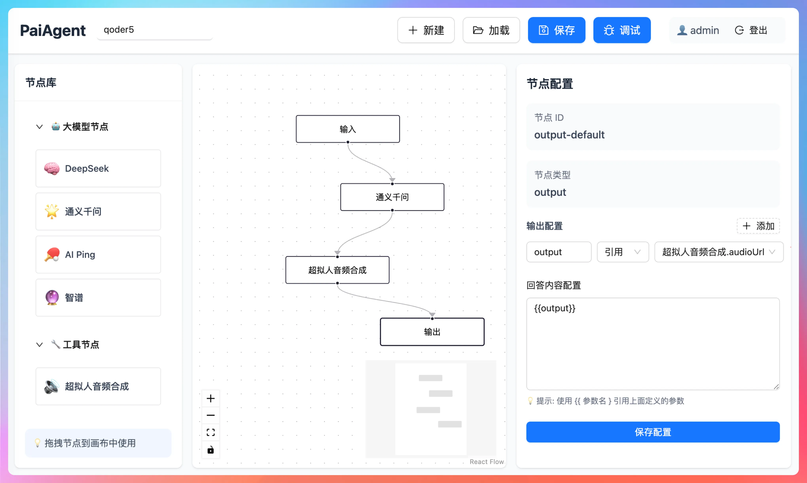
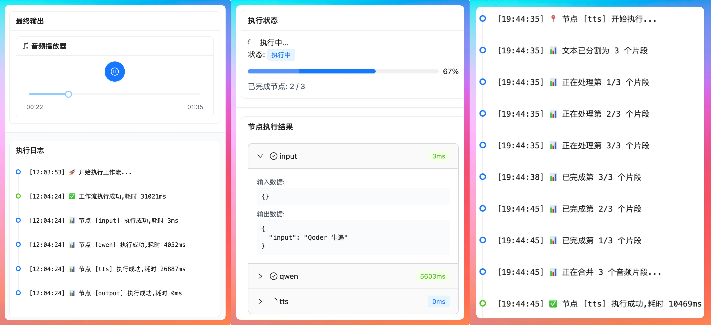
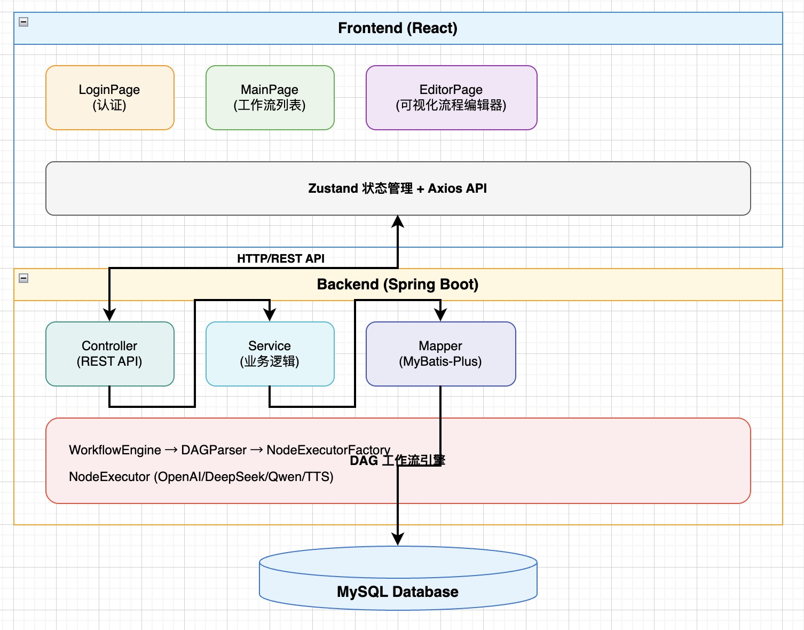

<div align="center">

# PaiAgent

**企业级 AI 工作流可视化编排平台**

通过拖拽式界面快速构建、编排和执行 AI 工作流，让 AI 能力组合更简单

[](LICENSE)
[](https://www.oracle.com/java/)
[](https://spring.io/projects/spring-boot)
[](https://spring.io/projects/spring-ai)
[](https://java2ai.com)
[](https://reactjs.org/)
[](https://www.typescriptlang.org/)

[快速开始](#-快速开始) • [功能特性](#-核心特性) • [技术架构](#-技术架构) • [使用文档](./USER_GUIDE.md) • [开发进度](./PROGRESS.md)

</div>

---

## 📖 项目简介

PaiAgent 是一个**企业级的 AI 工作流可视化编排平台**，让 AI 能力的组合和调度变得简单高效。通过直观的拖拽式界面，开发者和业务人员都能快速构建复杂的 AI 处理流程，无需编写代码即可实现多种大模型的协同工作。







### 💡 为什么选择 PaiAgent？

- **🎯 零代码编排**：可视化拖拽界面，无需编程即可构建复杂 AI 工作流
- **🚀 高性能引擎**：自研轻量级 DAG 引擎，支持拓扑排序和智能循环检测
- **🔌 多模型统一**：基于 Spring AI 框架，统一接入 OpenAI、DeepSeek、通义千问等主流大模型
- **🛠️ 灵活扩展**：基于插件化设计，轻松开发自定义节点满足个性化需求
- **🐛 实时调试**：内置调试面板，支持 SSE 流式输出，可视化执行过程
- **📦 开箱即用**：完整的前后端解决方案，快速部署到生产环境

## ✨ 核心特性

### 可视化流程编辑器

基于 ReactFlow 构建的专业流程图编辑器，支持节点拖拽、连线配置、参数编辑等完整功能。

### 多大模型节点支持

基于 **Spring AI + Spring AI Alibaba** 框架统一接入：

- **OpenAI 节点**：GPT-5 等模型（Spring AI OpenAI 接口）
- **DeepSeek 节点**：国产大模型（OpenAI 兼容接口）
- **通义千问节点**：阿里云千问系列（Spring AI Alibaba DashScope 原生支持）
- **智谱 AI 节点**：GLM 系列模型（OpenAI 兼容接口）
- **AIPing 节点**：第三方模型代理（OpenAI 兼容接口）

### 工具节点生态
- **TTS 音频合成**：超拟人语音生成
- **输入/输出节点**：灵活的数据输入输出
- **自定义扩展**：基于统一接口开发专属节点

### DAG 工作流引擎
- **拓扑排序**：基于 Kahn 算法的节点调度
- **循环检测**：DFS 深度优先搜索防止死循环
- **数据流转**：节点间智能数据传递机制
- **执行监控**：完整的执行日志和结果记录

## 🎯 应用场景

| 场景类别 | 具体应用 | 适用对象 |
|---------|---------|----------|
| 📝 内容生成 | 批量文章生成、多语言翻译、内容改写润色 | 内容创作者、营销团队 |
| 💬 智能客服 | 多轮对话流程、意图识别与智能响应 | 客服团队、产品经理 |
| 📊 数据处理 | 文本分析、信息抽取、数据清洗转换 | 数据分析师、研发团队 |
| 🎵 音视频处理 | 语音合成、字幕生成、音频转写 | 内容团队、教育行业 |
| ⚙️ 流程自动化 | 报告生成、邮件自动回复、定时任务 | 运营团队、企业用户 |

## 🏗️ 技术架构

### 系统架构

```
┌─────────────────────────────────────────────────────────┐
│                      前端层 (Frontend)                    │
│  React 18 + TypeScript + ReactFlow + Ant Design         │
│  • 可视化编辑器  • 节点面板  • 调试工具                    │
└────────────────────┬────────────────────────────────────┘
                     │ REST API / SSE
┌────────────────────┴────────────────────────────────────┐
│                    应用层 (Backend)                       │
│              Spring Boot 3.4.1 + Java 21                │
│  • Controller  • Service  • Interceptor                 │
└────────────────────┬────────────────────────────────────┘
                     │
┌────────────────────┴────────────────────────────────────┐
│                  核心引擎层 (Engine)                      │
│  • WorkflowEngine: 工作流调度引擎                         │
│  • DAGParser: 拓扑排序 + 循环检测                         │
│  • NodeExecutor: 节点执行器工厂                           │
└────────────────────┬────────────────────────────────────┘
                     │
┌────────────────────┴────────────────────────────────────┐
│                  AI 模型层 (Spring AI)                    │
│  • Spring AI: OpenAI/DeepSeek/智谱 等兼容接口             │
│  • Spring AI Alibaba: 通义千问 DashScope 原生支持         │
│  • ChatClientFactory: 统一的 ChatClient 动态工厂          │
└────────────────────┬────────────────────────────────────┘
                     │
┌────────────────────┴────────────────────────────────────┐
│              数据层 (Data & Storage)                     │
│  • MySQL: 工作流配置、执行记录                             │
│  • MinIO: 文件存储 (可选)                                 │
└─────────────────────────────────────────────────────────┘
```

### 技术栈详情

<table>
<tr>
<td><b>层级</b></td>
<td><b>技术选型</b></td>
<td><b>版本要求</b></td>
<td><b>说明</b></td>
</tr>
<tr>
<td rowspan="6"><b>前端</b></td>
<td>React</td>
<td>18.x</td>
<td>现代化 UI 框架</td>
</tr>
<tr>
<td>TypeScript</td>
<td>5.x</td>
<td>类型安全保障</td>
</tr>
<tr>
<td>Vite</td>
<td>5.x</td>
<td>高性能构建工具</td>
</tr>
<tr>
<td>ReactFlow</td>
<td>最新版</td>
<td>专业流程图库</td>
</tr>
<tr>
<td>Ant Design + Tailwind CSS</td>
<td>-</td>
<td>企业级 UI 组件</td>
</tr>
<tr>
<td>Zustand</td>
<td>最新版</td>
<td>轻量级状态管理</td>
</tr>
<tr>
<td rowspan="6"><b>后端</b></td>
<td>Spring Boot</td>
<td>3.4.1</td>
<td>企业级 Java 框架</td>
</tr>
<tr>
<td>Java</td>
<td>21+</td>
<td>LTS 长期支持版本</td>
</tr>
<tr>
<td>MyBatis-Plus</td>
<td>3.5.5</td>
<td>增强版 ORM 框架</td>
</tr>
<tr>
<td>Spring AI</td>
<td>1.0.0-M5</td>
<td>AI 模型统一调用框架</td>
</tr>
<tr>
<td>Spring AI Alibaba</td>
<td>1.0.0-M6.1</td>
<td>通义千问 DashScope 原生支持</td>
</tr>
<tr>
<td>MySQL</td>
<td>8.0+</td>
<td>关系型数据库</td>
</tr>
<tr>
<td>FastJSON2</td>
<td>最新版</td>
<td>高性能 JSON 库</td>
</tr>
<tr>
<td>MinIO</td>
<td>可选</td>
<td>对象存储服务</td>
</tr>
<tr>
<td rowspan="5"><b>核心引擎</b></td>
<td>自研 DAG 引擎</td>
<td>-</td>
<td>工作流编排核心</td>
</tr>
<tr>
<td>Kahn 拓扑排序</td>
<td>-</td>
<td>节点依赖分析</td>
</tr>
<tr>
<td>DFS 循环检测</td>
<td>-</td>
<td>防止工作流死锁</td>
</tr>
<tr>
<td>Spring AI ChatClient</td>
<td>-</td>
<td>统一 AI 模型调用接口</td>
</tr>
<tr>
<td>ChatClientFactory</td>
<td>-</td>
<td>动态创建不同模型客户端</td>
</tr>
</table>

## 📁 项目结构

```
PaiAgent-one/
├── backend/                      # Spring Boot 后端服务
│   ├── src/main/
│   │   ├── java/com/paiagent/
│   │   │   ├── engine/          # 🎯 DAG 工作流引擎（核心）
│   │   │   │   ├── WorkflowEngine.java       # 工作流编排引擎
│   │   │   │   ├── dag/DAGParser.java        # 拓扑排序+循环检测
│   │   │   │   ├── llm/                     # LLM 调用层（Spring AI）
│   │   │   │   │   ├── ChatClientFactory.java     # ChatClient 动态工厂
│   │   │   │   │   ├── PromptTemplateService.java # 提示词模板处理
│   │   │   │   │   └── LLMNodeConfig.java         # LLM 节点配置
│   │   │   │   ├── executor/                # 节点执行器
│   │   │   │   │   ├── NodeExecutor.java    # 执行器接口
│   │   │   │   │   ├── NodeExecutorFactory.java  # 工厂模式
│   │   │   │   │   └── impl/               # 具体实现
│   │   │   │   │       ├── AbstractLLMNodeExecutor.java  # LLM 抽象基类
│   │   │   │   │       ├── InputNodeExecutor.java
│   │   │   │   │       ├── OutputNodeExecutor.java
│   │   │   │   │       ├── OpenAINodeExecutor.java
│   │   │   │   │       ├── DeepSeekNodeExecutor.java
│   │   │   │   │       ├── QwenNodeExecutor.java
│   │   │   │   │       ├── ZhiPuNodeExecutor.java
│   │   │   │   │       ├── AIPingNodeExecutor.java
│   │   │   │   │       └── TTSNodeExecutor.java
│   │   │   │   └── model/                   # 数据模型
│   │   │   ├── controller/      # REST API 接口层
│   │   │   ├── service/         # 业务逻辑层
│   │   │   ├── mapper/          # MyBatis-Plus 数据访问层
│   │   │   ├── entity/          # 数据库实体
│   │   │   ├── dto/             # 数据传输对象
│   │   │   ├── config/          # 配置类
│   │   │   ├── interceptor/     # 拦截器（认证）
│   │   │   └── common/          # 通用工具
│   │   └── resources/
│   │       ├── application.yml  # 应用配置
│   │       └── schema.sql       # 数据库初始化脚本
│   └── pom.xml                  # Maven 依赖配置
│
├── frontend/                     # React 前端应用
│   ├── src/
│   │   ├── components/          # 🎨 核心组件
│   │   │   ├── FlowCanvas.tsx   # ReactFlow 流程编辑器
│   │   │   ├── NodePanel.tsx    # 可拖拽节点面板
│   │   │   ├── DebugDrawer.tsx  # 调试抽屉面板
│   │   │   └── AudioPlayer.tsx  # 音频播放器
│   │   ├── pages/               # 页面组件
│   │   │   ├── LoginPage.tsx    # 登录页
│   │   │   ├── MainPage.tsx     # 工作流列表页
│   │   │   └── EditorPage.tsx   # 工作流编辑器页
│   │   ├── store/               # Zustand 状态管理
│   │   │   ├── authStore.ts     # 用户认证状态
│   │   │   └── workflowStore.ts # 工作流编辑状态
│   │   ├── api/                 # API 调用层
│   │   ├── utils/               # 工具函数
│   │   └── App.tsx              # 应用入口
│   ├── package.json             # NPM 依赖配置
│   └── vite.config.ts           # Vite 构建配置
│
├── docs/                         # 📚 项目文档
│   ├── README.md                # 项目概览（当前文件）
│   ├── USER_GUIDE.md            # 用户使用指南
│   ├── PROGRESS.md              # 开发进度追踪
│   ├── SUMMARY.md               # 项目技术总结
│   ├── AGENTS.md                # AI Agent 开发指引
│   └── mermaid.md               # 架构可视化图表
│
└── .gitignore                   # Git 忽略配置
```

## 🚀 快速开始

### 环境要求

在开始之前，请确保您的开发环境满足以下要求：

| 工具 | 版本要求 | 说明 |
|------|---------|------|
| Java | 21+ | 推荐使用 OpenJDK 或 Oracle JDK |
| Node.js | 18+ | 包含 npm 包管理器 |
| MySQL | 8.0+ | 数据库服务 |
| Maven | 3.8+ | Java 项目构建工具 |

### 一键启动指南

#### 步骤 1：克隆项目

```bash
git clone https://github.com/yourusername/PaiAgent-one.git
cd PaiAgent-one
```

#### 步骤 2：配置数据库

**2.1 创建数据库**

```bash
mysql -u root -p
```

```sql
CREATE DATABASE paiagent DEFAULT CHARACTER SET utf8mb4 COLLATE utf8mb4_unicode_ci;
```

**2.2 导入初始化脚本**

```bash
mysql -u root -p paiagent < backend/src/main/resources/schema.sql
```

**2.3 配置数据库连接**

编辑 `backend/src/main/resources/application.yml`：

```yaml
spring:
  datasource:
    url: jdbc:mysql://localhost:3306/paiagent?useUnicode=true&characterEncoding=utf-8&useSSL=false&serverTimezone=Asia/Shanghai
    username: root
    password: your_password  # 修改为您的数据库密码
```

#### 步骤 3：启动后端服务

```bash
cd backend
./mvnw spring-boot:run
```

✅ 后端服务启动成功后，您将看到：
```
Started PaiAgentApplication in X.XXX seconds
```

后端服务地址：`http://localhost:8080`

#### 步骤 4：启动前端服务

打开新的终端窗口：

```bash
cd frontend
npm install
npm run dev
```

✅ 前端服务启动成功后，您将看到：
```
  ➜  Local:   http://localhost:5173/
```

#### 步骤 5：访问应用

| 服务 | 地址 | 说明 |
|------|------|------|
| 🌐 前端应用 | http://localhost:5173 | 主要操作界面 |
| 🔧 后端 API | http://localhost:8080 | REST API 服务 |
| 📚 API 文档 | http://localhost:8080/swagger-ui.html | Swagger 接口文档 |

**默认登录凭证**：
- 用户名：`admin`
- 密码：`123`

### 🎬 快速演示

创建您的第一个工作流：

1. **登录系统**：使用默认凭证登录
2. **创建工作流**：点击「新建工作流」按钮
3. **拖拽节点**：从左侧节点面板拖拽「输入节点」→「OpenAI节点」→「输出节点」到画布
4. **连接节点**：按顺序连接各个节点
5. **配置参数**：点击 OpenAI 节点，配置 API Key 和提示词
6. **执行调试**：点击「调试」按钮，查看执行结果

示例：文本转语音工作流
```
[输入节点] → [OpenAI节点] → [TTS节点] → [输出节点]
   输入文本     生成脚本      语音合成     播放音频
```

## 🗺️ 开发路线图

### ✅ 已完成功能 (v1.0)

- ✅ 基础架构搭建（Spring Boot + React + TypeScript）
- ✅ 用户认证系统（Token 认证 + 拦截器）
- ✅ 可视化流程编辑器（ReactFlow 集成）
- ✅ DAG 工作流引擎（拓扑排序 + 循环检测）
- ✅ **Spring AI 框架集成**（v1.0.0-M5）
  - 统一的 ChatClient 调用接口
  - 支持 OpenAI 兼容协议（OpenAI/DeepSeek/智谱/AIPing）
- ✅ **Spring AI Alibaba 集成**（v1.0.0-M6.1）
  - 通义千问 DashScope 原生支持
  - 阿里云 Qwen 系列模型接入
- ✅ 多大模型节点支持
  - OpenAI 节点（GPT 系列）
  - DeepSeek 节点
  - 通义千问节点
  - 智谱 AI 节点
  - AIPing 节点
- ✅ 工具节点实现
  - 输入/输出节点
  - TTS 音频合成节点
  - 音频播放器组件
- ✅ SSE 实时流式输出（调试抽屉 + 日志输出 + 结果展示）
- ✅ 工作流 CRUD 管理
- ✅ 执行记录查询

**当前完成度：95%** 🎉

### 🚧 规划中功能 (v1.1 - v2.0)

**v1.1 版本（近期）**
- 🔄 条件分支节点（IF/ELSE 逻辑）
- 🔁 循环执行节点（FOR/WHILE 循环）
- 📝 更多 LLM 节点接入（Claude、Gemini、本地模型）
- 🧪 集成测试完善
- 📊 执行性能监控

**v1.5 版本（中期）**
- 🔗 子工作流调用（工作流复用）
- ⏰ 定时任务调度（Cron 表达式）
- 📦 工作流版本管理（Git 风格）
- 🎨 工作流模板市场
- 🖼️ 更多工具节点（图像处理、文档解析、Web爬虫）

**v2.0 版本（远期）**
- 👥 多租户与权限管理
- 🤝 协作与分享功能
- 📈 性能监控与告警
- 🌍 国际化支持（多语言）
- 🔌 插件市场（第三方节点）

## 📚 项目文档

| 文档类型 | 文档链接 | 说明 |
|---------|---------|------|
| 📖 使用指南 | [USER_GUIDE.md](./USER_GUIDE.md) | 详细使用说明和最佳实践 |
| 📊 开发进度 | [PROGRESS.md](./PROGRESS.md) | 项目开发阶段和完成情况 |
| 📝 项目总结 | [SUMMARY.md](./SUMMARY.md) | 技术选型和实现总结 |
| 📋 完成报告 | [PROJECT_COMPLETION_REPORT.md](./PROJECT_COMPLETION_REPORT.md) | 项目交付报告 |
| 🏗️ 架构设计 | [mermaid.md](./mermaid.md) | 系统架构可视化图表 |
| 🤖 开发指南 | [AGENTS.md](./AGENTS.md) | AI Agent 开发指引 |

## 🔧 核心功能详解

### 工作流编排

**节点类型**
- **输入节点**：接收外部输入数据，作为工作流的起点
- **输出节点**：输出工作流执行结果，作为工作流的终点
- **LLM 节点**：调用大语言模型进行文本生成、理解等任务
- **工具节点**：执行特定功能，如 TTS 语音合成、图像处理等

**连线规则**
- 节点之间通过有向边连接，表示数据流向
- 支持一对多、多对一的连接方式
- 自动检测循环依赖，防止死锁

### DAG 引擎机制

**工作流解析流程**
1. **JSON 解析**：将前端配置解析为 WorkflowConfig 对象
2. **拓扑排序**：使用 Kahn 算法确定节点执行顺序
3. **循环检测**：DFS 深度优先搜索检测循环依赖
4. **节点调度**：按拓扑顺序依次执行节点
5. **数据传递**：上游节点输出作为下游节点输入
6. **结果记录**：保存每个节点的执行结果和日志

**数据传递机制**
```java
// 节点执行器接口
public interface NodeExecutor {
    Map<String, Object> execute(WorkflowNode node, Map<String, Object> input);
}

// LLM 节点通过 Spring AI ChatClient 统一调用
ChatClient chatClient = chatClientFactory.createClient(nodeType, apiUrl, apiKey, model, temperature);
String response = chatClient.prompt().user(prompt).call().content();
```

### 节点扩展开发

**方式一：开发普通工具节点**
1. **实现 NodeExecutor 接口**
```java
public class CustomNodeExecutor implements NodeExecutor {
    @Override
    public Map<String, Object> execute(WorkflowNode node, Map<String, Object> input) {
        // 自定义逻辑
        return output;
    }
}
```

2. **注册到工厂**
```java
NodeExecutorFactory.register("custom", new CustomNodeExecutor());
```

**方式二：开发 LLM 节点（推荐）**
```java
// 继承 AbstractLLMNodeExecutor，自动获得 Spring AI 能力
@Component
public class CustomLLMNodeExecutor extends AbstractLLMNodeExecutor {
    @Override
    protected String getNodeType() {
        return "custom_llm";
    }
}
```

3. **前端添加节点定义**
```typescript
const customNode = {
  type: 'custom',
  label: '自定义节点',
  category: 'tool'
};
```

## 💼 项目亮点（简历版）

**项目名称**：PaiAgent - 企业级 AI 工作流编排平台

**项目描述**：基于可视化流程编辑器的 AI Agent 工作流平台，支持用户通过拖拽方式编排多种大模型（DeepSeek、通义千问等）和工具节点，使用自研 DAG 引擎按拓扑顺序执行工作流，实现复杂 AI 任务的自动化编排与执行。

**技术栈**：Java 21、Spring Boot 3.4.1、Spring AI 1.0.0

**核心职责**：

- 基于 Spring AI 框架重构 LLM 通信层，采用工厂模式+模板方法模式设计 ChatClientFactory 动态工厂和 AbstractLLMNodeExecutor 抽象基类，将 5 个 LLM 节点执行器的重复代码从 800+行精简至 75 行
- 设计动态 ChatClient 创建机制，支持运行时根据工作流节点配置（apiKey/apiUrl/model）动态实例化不同厂商的 ChatClient，实现多租户场景下每个节点独立配置的能力
- 抽取 PromptTemplateService 公共服务，统一处理 `{{variable}}` 模板变量替换和上下游节点参数引用映射，支持 input 静态值和 reference 动态引用两种参数类型
- 基于 Spring AI 的 Flux 响应式流实现 LLM 流式输出，通过 SSE 实时推送生成进度到前端，配合现有 ExecutionEvent 事件机制，用户可实时查看 AI 生成过程

## 🤝 贡献指南

我们欢迎所有形式的贡献，包括但不限于：

- 🐛 提交 Bug 报告
- 💡 提出新功能建议
- 📝 改进文档
- 🔧 提交代码修复
- ⭐ Star 项目支持我们

### 参与方式

1. **Fork 本仓库**
2. **创建特性分支** (`git checkout -b feature/AmazingFeature`)
3. **提交更改** (`git commit -m 'Add some AmazingFeature'`)
4. **推送到分支** (`git push origin feature/AmazingFeature`)
5. **开启 Pull Request**

### 代码规范

- **后端**：遵循阿里巴巴 Java 开发手册
- **前端**：遵循 Airbnb React/JSX 风格指南
- **提交信息**：使用约定式提交（Conventional Commits）

## 💬 社区与支持

### 获取帮助

- 📬 **GitHub Issues**：[问题反馈和功能建议](https://github.com/yourusername/PaiAgent-one/issues)
- 💭 **GitHub Discussions**：[技术讨论和经验分享](https://github.com/yourusername/PaiAgent-one/discussions)
- 📖 **官方文档**：查看 [USER_GUIDE.md](./USER_GUIDE.md) 获取完整使用指南

### 联系方式

- **项目维护者**：[@itwanger](https://github.com/itwanger)
- **邮箱**：项目相关问题请通过 GitHub Issues 提交

## 📄 许可证

本项目采用 [MIT License](LICENSE) 开源协议。

## 🌟 致谢

感谢所有为本项目做出贡献的开发者！

---

<div align="center">

**如果这个项目对您有帮助，请点击 ⭐ Star 支持我们！**

[⬆ 回到顶部](#paiagent-one)

</div>
