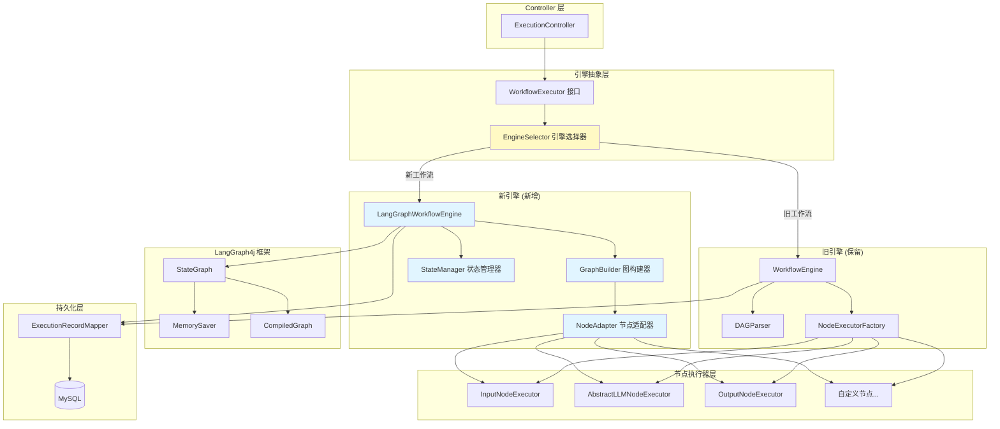
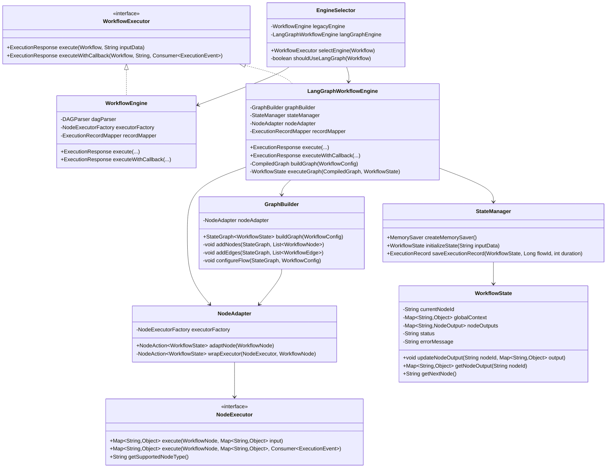
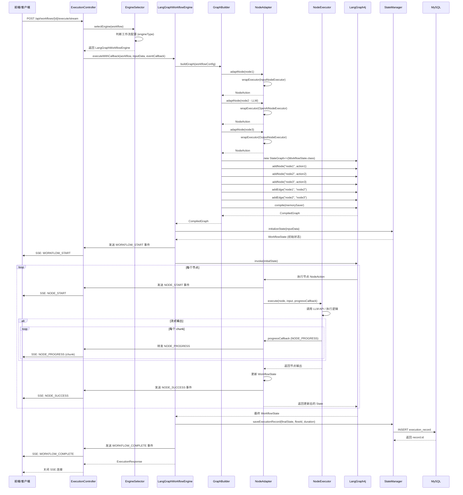

# LangGraph4j 集成 - 技术设计文档

## 📋 文档信息
- **创建时间**: 2026-01-26
- **设计负责人**: Design Agent
- **项目版本**: PaiAgent v1.0
- **设计状态**: 待审核

---

## 🎯 1. 设计概述

### 1.1 背景与动机

**现状分析**：
- 当前系统使用简单的 DAG 拓扑排序执行工作流
- 仅支持线性/并行流程，不支持条件分支、循环等复杂编排
- 缺乏 Agent 场景所需的状态管理、工具调用、推理循环能力

**为什么选择 LangGraph4j**：
1. ✅ **状态图引擎**：支持条件分支、循环、子图等复杂编排能力
2. ✅ **原生 Agent 支持**：为 ReAct、Plan-and-Execute 等模式设计
3. ✅ **Spring AI 集成**：与现有技术栈完美兼容
4. ✅ **生产就绪**：提供状态持久化、检查点、错误恢复等企业特性

### 1.2 核心目标

| 优先级 | 目标 | 说明 |
|--------|------|------|
| **P0** | 增强工作流编排能力 | 支持条件分支、循环、子图等高级特性 |
| **P0** | 为 Agent 场景做技术储备 | 为后续 ReAct、自主决策等场景打基础 |
| **P0** | 保持现有功能完全兼容 | API 接口不变，前端无需改动 |
| **P1** | 提升系统扩展性 | 通过适配器模式降低新节点接入成本 |

### 1.3 核心设计原则

```
🔄 渐进式集成：新老引擎并存，逐步迁移
🛡️ 100% 向后兼容：现有工作流继续使用旧引擎
🔌 适配器模式：将现有节点无缝接入 LangGraph
📊 统一接口：对外 API 保持不变
```

---

## 🏗️ 2. 架构设计

### 2.1 总体架构图



### 2.2 关键设计决策

| 决策点 | 选择方案 | 理由 |
|--------|----------|------|
| **引擎共存方式** | 策略模式 + 工厂方法 | 根据工作流配置动态选择引擎，支持灰度迁移 |
| **节点复用策略** | 适配器模式 | 现有 NodeExecutor 不改动，通过适配器接入 LangGraph |
| **状态管理** | 内存状态 (MemorySaver) + 执行记录持久化 | 与现有逻辑一致，降低复杂度 |
| **SSE 支持** | 统一事件适配器 | 将 LangGraph 事件转换为 ExecutionEvent，前端无感知 |

---

## 📐 3. 详细设计

### 3.1 类图设计



### 3.2 时序图 - 新引擎执行流程



---

## 💻 4. 核心组件详细设计

### 4.1 WorkflowExecutor 接口

**职责**：定义工作流引擎的统一接口，屏蔽底层实现差异

```java
package com.paiagent.engine;

import com.paiagent.dto.ExecutionEvent;
import com.paiagent.dto.ExecutionResponse;
import com.paiagent.entity.Workflow;

import java.util.function.Consumer;

/**
 * 工作流执行器接口
 * 定义统一的工作流执行标准，支持多种引擎实现
 */
public interface WorkflowExecutor {
    
    /**
     * 同步执行工作流
     * 
     * @param workflow 工作流定义
     * @param inputData 输入数据（JSON 字符串）
     * @return 执行结果
     */
    ExecutionResponse execute(Workflow workflow, String inputData);
    
    /**
     * 带事件回调的工作流执行（支持 SSE 流式输出）
     * 
     * @param workflow 工作流定义
     * @param inputData 输入数据
     * @param eventCallback 事件回调函数（用于实时反馈执行进度）
     * @return 执行结果
     */
    ExecutionResponse executeWithCallback(
        Workflow workflow, 
        String inputData, 
        Consumer<ExecutionEvent> eventCallback
    );
    
    /**
     * 获取引擎类型标识
     * @return 引擎类型 (例如: "legacy", "langgraph")
     */
    default String getEngineType() {
        return "unknown";
    }
}
```

**设计要点**：
- ✅ 完全兼容现有 `WorkflowEngine` 的方法签名
- ✅ 支持同步和异步（带回调）两种执行模式
- ✅ 通过 `eventCallback` 实现 SSE 事件流推送

---

### 4.2 EngineSelector - 引擎选择器

**职责**：根据工作流配置动态选择合适的引擎

```java
package com.paiagent.engine;

import com.alibaba.fastjson2.JSON;
import com.paiagent.engine.model.WorkflowConfig;
import com.paiagent.entity.Workflow;
import lombok.extern.slf4j.Slf4j;
import org.springframework.beans.factory.annotation.Autowired;
import org.springframework.stereotype.Component;

/**
 * 工作流引擎选择器
 * 根据工作流配置决定使用哪个执行引擎
 */
@Slf4j
@Component
public class EngineSelector {
    
    @Autowired
    private WorkflowEngine legacyEngine;
    
    @Autowired
    private LangGraphWorkflowEngine langGraphEngine;
    
    /**
     * 选择合适的执行引擎
     * 
     * @param workflow 工作流定义
     * @return 执行引擎实例
     */
    public WorkflowExecutor selectEngine(Workflow workflow) {
        if (shouldUseLangGraph(workflow)) {
            log.info("工作流 {} 使用 LangGraph 引擎执行", workflow.getId());
            return langGraphEngine;
        }
        
        log.info("工作流 {} 使用传统 DAG 引擎执行", workflow.getId());
        return legacyEngine;
    }
    
    /**
     * 判断是否应该使用 LangGraph 引擎
     * 
     * 规则：
     * 1. 工作流配置中显式声明 engineType: "langgraph"
     * 2. 存在条件分支节点 (condition、switch 等)
     * 3. 存在循环节点 (loop、while 等)
     * 
     * @param workflow 工作流定义
     * @return true 使用 LangGraph，false 使用传统引擎
     */
    private boolean shouldUseLangGraph(Workflow workflow) {
        try {
            WorkflowConfig config = JSON.parseObject(workflow.getFlowData(), WorkflowConfig.class);
            
            // 规则 1: 显式配置优先
            if (config.getMetadata() != null) {
                String engineType = (String) config.getMetadata().get("engineType");
                if ("langgraph".equalsIgnoreCase(engineType)) {
                    return true;
                }
                if ("legacy".equalsIgnoreCase(engineType)) {
                    return false;
                }
            }
            
            // 规则 2 & 3: 根据节点类型自动判断
            boolean hasAdvancedNode = config.getNodes().stream()
                .anyMatch(node -> isAdvancedNode(node.getType()));
            
            return hasAdvancedNode;
            
        } catch (Exception e) {
            log.error("解析工作流配置失败，使用默认引擎", e);
            return false; // 出错时使用稳定的旧引擎
        }
    }
    
    /**
     * 判断是否为高级节点（需要 LangGraph 支持）
     */
    private boolean isAdvancedNode(String nodeType) {
        return nodeType != null && (
            nodeType.startsWith("condition") ||
            nodeType.startsWith("switch") ||
            nodeType.startsWith("loop") ||
            nodeType.equals("agent") ||
            nodeType.equals("tool")
        );
    }
}
```

**选择规则**：
1. **显式配置优先**：工作流 metadata 中设置 `"engineType": "langgraph"`
2. **自动检测**：包含条件分支/循环等高级节点时自动启用 LangGraph
3. **向后兼容**：默认使用旧引擎，确保现有流程不受影响

---

### 4.3 WorkflowState - 状态模型

**职责**：LangGraph 的状态载体，贯穿整个执行流程

```java
package com.paiagent.engine.langgraph;

import lombok.Data;

import java.util.HashMap;
import java.util.Map;

/**
 * LangGraph 工作流状态
 * 作为状态图执行过程中的数据载体
 */
@Data
public class WorkflowState {
    
    /**
     * 当前执行到的节点 ID
     */
    private String currentNodeId;
    
    /**
     * 全局上下文（跨节点共享数据）
     */
    private Map<String, Object> globalContext = new HashMap<>();
    
    /**
     * 每个节点的输出结果
     * Key: 节点ID, Value: 节点输出
     */
    private Map<String, NodeOutput> nodeOutputs = new HashMap<>();
    
    /**
     * 执行状态 (RUNNING, SUCCESS, FAILED)
     */
    private String status = "RUNNING";
    
    /**
     * 错误信息（如果执行失败）
     */
    private String errorMessage;
    
    /**
     * 执行开始时间戳
     */
    private Long startTime;
    
    /**
     * 初始输入数据
     */
    private String inputData;
    
    /**
     * 更新节点输出
     */
    public void updateNodeOutput(String nodeId, Map<String, Object> output, String status) {
        NodeOutput nodeOutput = new NodeOutput();
        nodeOutput.setNodeId(nodeId);
        nodeOutput.setOutput(output);
        nodeOutput.setStatus(status);
        nodeOutput.setTimestamp(System.currentTimeMillis());
        
        this.nodeOutputs.put(nodeId, nodeOutput);
        this.currentNodeId = nodeId;
    }
    
    /**
     * 获取指定节点的输出
     */
    public Map<String, Object> getNodeOutput(String nodeId) {
        NodeOutput output = nodeOutputs.get(nodeId);
        return output != null ? output.getOutput() : new HashMap<>();
    }
    
    /**
     * 获取前一个节点的输出（用于链式传递）
     */
    public Map<String, Object> getPreviousNodeOutput() {
        return getNodeOutput(currentNodeId);
    }
    
    /**
     * 节点输出封装
     */
    @Data
    public static class NodeOutput {
        private String nodeId;
        private Map<String, Object> output;
        private String status;
        private Long timestamp;
    }
}
```

**关键特性**：
- 📦 **全局上下文**：支持跨节点数据共享（为 Agent 场景准备）
- 🔗 **节点输出链**：记录每个节点的执行结果
- 🎯 **状态跟踪**：实时记录当前执行位置和状态

---

### 4.4 GraphBuilder - 图构建器

**职责**：将 WorkflowConfig 转换为 LangGraph StateGraph

```java
package com.paiagent.engine.langgraph;

import com.paiagent.engine.model.WorkflowConfig;
import com.paiagent.engine.model.WorkflowEdge;
import com.paiagent.engine.model.WorkflowNode;
import lombok.extern.slf4j.Slf4j;
import org.bsc.langgraph4j.StateGraph;
import org.bsc.langgraph4j.action.NodeAction;
import org.springframework.beans.factory.annotation.Autowired;
import org.springframework.stereotype.Component;

import java.util.List;
import java.util.Map;

/**
 * LangGraph 状态图构建器
 * 将工作流配置转换为 LangGraph4j 的 StateGraph
 */
@Slf4j
@Component
public class GraphBuilder {
    
    @Autowired
    private NodeAdapter nodeAdapter;
    
    /**
     * 构建状态图
     * 
     * @param config 工作流配置
     * @return LangGraph StateGraph 实例
     */
    public StateGraph<WorkflowState> buildGraph(WorkflowConfig config) throws Exception {
        StateGraph<WorkflowState> stateGraph = new StateGraph<>(WorkflowState.class);
        
        // 1. 添加所有节点
        addNodes(stateGraph, config.getNodes());
        
        // 2. 添加边（定义节点间的连接关系）
        addEdges(stateGraph, config.getEdges());
        
        // 3. 设置入口节点和结束节点
        configureFlow(stateGraph, config);
        
        log.info("StateGraph 构建完成: {} 个节点, {} 条边", 
                config.getNodes().size(), config.getEdges().size());
        
        return stateGraph;
    }
    
    /**
     * 添加节点到状态图
     */
    private void addNodes(StateGraph<WorkflowState> graph, List<WorkflowNode> nodes) throws Exception {
        for (WorkflowNode node : nodes) {
            NodeAction<WorkflowState> action = nodeAdapter.adaptNode(node);
            graph.addNode(node.getId(), action);
            log.debug("添加节点: {} (类型: {})", node.getId(), node.getType());
        }
    }
    
    /**
     * 添加边到状态图
     */
    private void addEdges(StateGraph<WorkflowState> graph, List<WorkflowEdge> edges) {
        for (WorkflowEdge edge : edges) {
            // 根据边的类型添加不同类型的连接
            if (edge.getType() == null || "default".equals(edge.getType())) {
                // 普通边：无条件连接
                graph.addEdge(edge.getSource(), edge.getTarget());
                log.debug("添加普通边: {} -> {}", edge.getSource(), edge.getTarget());
            } else if ("conditional".equals(edge.getType())) {
                // 条件边：根据状态动态路由（未来扩展）
                addConditionalEdge(graph, edge);
            }
        }
    }
    
    /**
     * 添加条件边（为未来的条件分支预留）
     */
    private void addConditionalEdge(StateGraph<WorkflowState> graph, WorkflowEdge edge) {
        // 示例：条件边实现
        // Map<String, Object> edgeData = edge.getData();
        // String condition = (String) edgeData.get("condition");
        // 
        // graph.addConditionalEdges(
        //     edge.getSource(),
        //     state -> evaluateCondition(state, condition),
        //     Map.of("true", edge.getTarget())
        // );
        
        // 当前阶段暂不实现，直接当作普通边处理
        graph.addEdge(edge.getSource(), edge.getTarget());
        log.warn("条件边暂未实现，当作普通边处理: {} -> {}", edge.getSource(), edge.getTarget());
    }
    
    /**
     * 配置流程入口和出口
     */
    private void configureFlow(StateGraph<WorkflowState> graph, WorkflowConfig config) {
        // 查找入口节点（通常是 "input" 类型）
        WorkflowNode entryNode = config.getNodes().stream()
                .filter(node -> "input".equals(node.getType()))
                .findFirst()
                .orElse(config.getNodes().get(0)); // 找不到就用第一个
        
        // 查找出口节点（通常是 "output" 类型）
        WorkflowNode exitNode = config.getNodes().stream()
                .filter(node -> "output".equals(node.getType()))
                .findFirst()
                .orElse(null);
        
        graph.setEntryPoint(entryNode.getId());
        
        if (exitNode != null) {
            graph.setFinishPoint(exitNode.getId());
        }
        
        log.info("设置入口节点: {}, 出口节点: {}", 
                entryNode.getId(), exitNode != null ? exitNode.getId() : "未设置");
    }
}
```

**核心功能**：
1. ✅ 将 JSON 配置转换为 LangGraph API 调用
2. ✅ 支持普通边和条件边（条件边预留扩展点）
3. ✅ 自动识别入口/出口节点

---

### 4.5 NodeAdapter - 节点适配器

**职责**：将现有 NodeExecutor 包装成 LangGraph NodeAction

```java
package com.paiagent.engine.langgraph;

import com.paiagent.dto.ExecutionEvent;
import com.paiagent.engine.executor.NodeExecutor;
import com.paiagent.engine.executor.NodeExecutorFactory;
import com.paiagent.engine.model.WorkflowNode;
import lombok.extern.slf4j.Slf4j;
import org.bsc.langgraph4j.action.NodeAction;
import org.springframework.beans.factory.annotation.Autowired;
import org.springframework.stereotype.Component;

import java.util.Map;
import java.util.function.Consumer;

/**
 * 节点适配器
 * 将现有的 NodeExecutor 适配为 LangGraph4j 的 NodeAction
 */
@Slf4j
@Component
public class NodeAdapter {
    
    @Autowired
    private NodeExecutorFactory executorFactory;
    
    /**
     * SSE 事件回调（从 LangGraphWorkflowEngine 注入）
     */
    private ThreadLocal<Consumer<ExecutionEvent>> eventCallbackHolder = new ThreadLocal<>();
    
    /**
     * 设置当前线程的事件回调
     */
    public void setEventCallback(Consumer<ExecutionEvent> callback) {
        eventCallbackHolder.set(callback);
    }
    
    /**
     * 清除当前线程的事件回调
     */
    public void clearEventCallback() {
        eventCallbackHolder.remove();
    }
    
    /**
     * 将 WorkflowNode 适配为 LangGraph NodeAction
     * 
     * @param node 工作流节点定义
     * @return LangGraph NodeAction
     */
    public NodeAction<WorkflowState> adaptNode(WorkflowNode node) throws Exception {
        NodeExecutor executor = executorFactory.getExecutor(node.getType());
        
        return wrapExecutor(executor, node);
    }
    
    /**
     * 包装 NodeExecutor 为 NodeAction
     * 
     * NodeAction 签名: Map<String, Object> execute(WorkflowState state)
     * NodeExecutor 签名: Map<String, Object> execute(WorkflowNode node, Map<String, Object> input, ...)
     */
    private NodeAction<WorkflowState> wrapExecutor(NodeExecutor executor, WorkflowNode node) {
        return state -> {
            long startTime = System.currentTimeMillis();
            
            // 获取事件回调
            Consumer<ExecutionEvent> callback = eventCallbackHolder.get();
            
            // 发送节点开始事件
            if (callback != null) {
                callback.accept(ExecutionEvent.nodeStart(node.getId(), node.getType()));
            }
            
            try {
                // 构建节点输入：使用前一个节点的输出
                Map<String, Object> input = state.getPreviousNodeOutput();
                
                // 如果是第一个节点，使用初始输入
                if (input.isEmpty() && state.getInputData() != null) {
                    input = Map.of("input", state.getInputData());
                }
                
                log.debug("节点 {} 执行输入: {}", node.getId(), input);
                
                // 调用原有的 NodeExecutor
                Map<String, Object> output = executor.execute(node, input, callback);
                
                log.debug("节点 {} 执行输出: {}", node.getId(), output);
                
                // 更新状态
                state.updateNodeOutput(node.getId(), output, "SUCCESS");
                
                // 发送节点成功事件
                long duration = System.currentTimeMillis() - startTime;
                if (callback != null) {
                    Map<String, Object> eventData = Map.of(
                        "input", input,
                        "output", output,
                        "duration", duration
                    );
                    callback.accept(ExecutionEvent.nodeSuccess(
                        node.getId(), node.getType(), eventData, (int) duration
                    ));
                }
                
                // 返回更新后的状态（LangGraph 要求）
                return Map.of("state", state);
                
            } catch (Exception e) {
                log.error("节点 {} 执行失败", node.getId(), e);
                
                // 更新状态为失败
                state.setStatus("FAILED");
                state.setErrorMessage("节点 " + node.getId() + " 执行失败: " + e.getMessage());
                state.updateNodeOutput(node.getId(), Map.of(), "FAILED");
                
                // 发送节点失败事件
                if (callback != null) {
                    callback.accept(ExecutionEvent.nodeError(node.getId(), node.getType(), e.getMessage()));
                }
                
                throw e; // 抛出异常让 LangGraph 中断执行
            }
        };
    }
}
```

**适配原理**：
- 🔌 **接口转换**：NodeAction 包装 NodeExecutor 的 execute 方法
- 🔗 **数据流转**：从 WorkflowState 提取输入，将输出写回 State
- 📡 **事件透传**：通过 ThreadLocal 传递 SSE 回调

---

### 4.6 StateManager - 状态管理器

**职责**：初始化状态、配置 MemorySaver、持久化执行记录

```java
package com.paiagent.engine.langgraph;

import com.alibaba.fastjson2.JSON;
import com.paiagent.dto.ExecutionResponse;
import com.paiagent.entity.ExecutionRecord;
import lombok.extern.slf4j.Slf4j;
import org.bsc.langgraph4j.checkpoint.MemorySaver;
import org.springframework.stereotype.Component;

import java.util.ArrayList;
import java.util.List;
import java.util.Map;

/**
 * 状态管理器
 * 负责 WorkflowState 的初始化、持久化和恢复
 */
@Slf4j
@Component
public class StateManager {
    
    /**
     * 创建内存状态保存器（LangGraph 检查点机制）
     */
    public MemorySaver createMemorySaver() {
        return new MemorySaver();
    }
    
    /**
     * 初始化工作流状态
     * 
     * @param inputData 初始输入数据
     * @return 初始化后的状态对象
     */
    public WorkflowState initializeState(String inputData) {
        WorkflowState state = new WorkflowState();
        state.setInputData(inputData);
        state.setStartTime(System.currentTimeMillis());
        state.setStatus("RUNNING");
        state.getGlobalContext().put("startTime", state.getStartTime());
        
        log.debug("初始化工作流状态: {}", inputData);
        return state;
    }
    
    /**
     * 保存执行记录到数据库
     * 
     * @param state 最终状态
     * @param flowId 工作流 ID
     * @param duration 执行耗时
     * @return 执行记录实体
     */
    public ExecutionRecord saveExecutionRecord(WorkflowState state, Long flowId, int duration) {
        ExecutionRecord record = new ExecutionRecord();
        record.setFlowId(flowId);
        
        // 保存输入数据
        String inputDataJson = JSON.toJSONString(Map.of("input", state.getInputData()));
        record.setInputData(inputDataJson);
        
        // 保存输出数据（最后一个节点的输出）
        Map<String, Object> finalOutput = state.getPreviousNodeOutput();
        record.setOutputData(JSON.toJSONString(finalOutput));
        
        // 保存状态
        record.setStatus(state.getStatus());
        record.setErrorMessage(state.getErrorMessage());
        record.setDuration(duration);
        
        // 保存每个节点的执行结果
        List<ExecutionResponse.NodeResult> nodeResults = new ArrayList<>();
        state.getNodeOutputs().forEach((nodeId, output) -> {
            ExecutionResponse.NodeResult nodeResult = new ExecutionResponse.NodeResult();
            nodeResult.setNodeId(nodeId);
            nodeResult.setNodeName(nodeId); // 简化版，后续可优化
            nodeResult.setStatus(output.getStatus());
            nodeResult.setInput(""); // 可选：记录节点输入
            nodeResult.setOutput(JSON.toJSONString(output.getOutput()));
            nodeResult.setDuration(0); // 可选：记录节点耗时
            nodeResults.add(nodeResult);
        });
        record.setNodeResults(JSON.toJSONString(nodeResults));
        
        log.info("保存执行记录 - flowId: {}, status: {}, duration: {}ms", 
                flowId, state.getStatus(), duration);
        
        return record;
    }
}
```

---

### 4.7 LangGraphWorkflowEngine - 核心引擎

**职责**：LangGraph 执行引擎的主入口

```java
package com.paiagent.engine.langgraph;

import com.alibaba.fastjson2.JSON;
import com.paiagent.dto.ExecutionEvent;
import com.paiagent.dto.ExecutionResponse;
import com.paiagent.engine.WorkflowExecutor;
import com.paiagent.engine.model.WorkflowConfig;
import com.paiagent.entity.ExecutionRecord;
import com.paiagent.entity.Workflow;
import com.paiagent.mapper.ExecutionRecordMapper;
import lombok.extern.slf4j.Slf4j;
import org.bsc.langgraph4j.CompiledGraph;
import org.bsc.langgraph4j.StateGraph;
import org.bsc.langgraph4j.checkpoint.MemorySaver;
import org.springframework.beans.factory.annotation.Autowired;
import org.springframework.stereotype.Service;

import java.util.Map;
import java.util.function.Consumer;

/**
 * LangGraph4j 工作流执行引擎
 * 基于状态图实现的新一代工作流引擎
 */
@Slf4j
@Service
public class LangGraphWorkflowEngine implements WorkflowExecutor {
    
    @Autowired
    private GraphBuilder graphBuilder;
    
    @Autowired
    private StateManager stateManager;
    
    @Autowired
    private NodeAdapter nodeAdapter;
    
    @Autowired
    private ExecutionRecordMapper executionRecordMapper;
    
    @Override
    public String getEngineType() {
        return "langgraph";
    }
    
    @Override
    public ExecutionResponse execute(Workflow workflow, String inputData) {
        return executeWithCallback(workflow, inputData, null);
    }
    
    @Override
    public ExecutionResponse executeWithCallback(
            Workflow workflow, 
            String inputData, 
            Consumer<ExecutionEvent> eventCallback) {
        
        long startTime = System.currentTimeMillis();
        
        try {
            // 1. 解析工作流配置
            WorkflowConfig config = JSON.parseObject(workflow.getFlowData(), WorkflowConfig.class);
            
            // 2. 设置事件回调（通过 ThreadLocal 传递给 NodeAdapter）
            if (eventCallback != null) {
                nodeAdapter.setEventCallback(eventCallback);
                eventCallback.accept(ExecutionEvent.workflowStart(null));
            }
            
            // 3. 构建状态图
            StateGraph<WorkflowState> stateGraph = graphBuilder.buildGraph(config);
            
            // 4. 编译图（配置 MemorySaver）
            MemorySaver memorySaver = stateManager.createMemorySaver();
            CompiledGraph<WorkflowState> compiledGraph = stateGraph.compile(memorySaver);
            
            // 5. 初始化状态
            WorkflowState initialState = stateManager.initializeState(inputData);
            
            // 6. 执行图
            Map<String, Object> result = compiledGraph.invoke(
                Map.of("state", initialState)
            );
            
            // 7. 提取最终状态
            WorkflowState finalState = (WorkflowState) result.get("state");
            
            // 8. 计算耗时
            long endTime = System.currentTimeMillis();
            int duration = (int) (endTime - startTime);
            
            // 9. 发送完成事件
            if (eventCallback != null) {
                eventCallback.accept(ExecutionEvent.workflowComplete(
                    finalState.getStatus(),
                    finalState.getPreviousNodeOutput(),
                    duration
                ));
            }
            
            // 10. 持久化执行记录
            ExecutionRecord record = stateManager.saveExecutionRecord(finalState, workflow.getId(), duration);
            executionRecordMapper.insert(record);
            
            // 11. 构建响应
            return buildExecutionResponse(record, finalState, duration);
            
        } catch (Exception e) {
            log.error("LangGraph 工作流执行失败", e);
            
            // 失败时也要记录
            int duration = (int) (System.currentTimeMillis() - startTime);
            ExecutionRecord failedRecord = createFailedRecord(workflow.getId(), inputData, e, duration);
            executionRecordMapper.insert(failedRecord);
            
            if (eventCallback != null) {
                eventCallback.accept(ExecutionEvent.workflowComplete("FAILED", e.getMessage(), duration));
            }
            
            return buildFailedResponse(failedRecord, duration);
            
        } finally {
            // 清理 ThreadLocal
            nodeAdapter.clearEventCallback();
        }
    }
    
    /**
     * 构建执行响应
     */
    private ExecutionResponse buildExecutionResponse(
            ExecutionRecord record, 
            WorkflowState state, 
            int duration) {
        
        ExecutionResponse response = new ExecutionResponse();
        response.setExecutionId(record.getId());
        response.setStatus(state.getStatus());
        response.setOutputData(JSON.toJSONString(state.getPreviousNodeOutput()));
        response.setDuration(duration);
        
        // 转换节点结果
        response.setNodeResults(JSON.parseArray(record.getNodeResults(), ExecutionResponse.NodeResult.class));
        
        return response;
    }
    
    /**
     * 创建失败记录
     */
    private ExecutionRecord createFailedRecord(Long flowId, String inputData, Exception e, int duration) {
        ExecutionRecord record = new ExecutionRecord();
        record.setFlowId(flowId);
        record.setInputData(JSON.toJSONString(Map.of("input", inputData)));
        record.setOutputData(null);
        record.setStatus("FAILED");
        record.setErrorMessage(e.getMessage());
        record.setDuration(duration);
        record.setNodeResults("[]");
        return record;
    }
    
    /**
     * 构建失败响应
     */
    private ExecutionResponse buildFailedResponse(ExecutionRecord record, int duration) {
        ExecutionResponse response = new ExecutionResponse();
        response.setExecutionId(record.getId());
        response.setStatus("FAILED");
        response.setDuration(duration);
        response.setNodeResults(new java.util.ArrayList<>());
        return response;
    }
}
```

**执行流程**：
1. 解析配置 → 2. 构建图 → 3. 编译图 → 4. 初始化状态 → 5. 执行图 → 6. 持久化结果

---

## 🔄 5. 工作流配置示例

### 5.1 使用 LangGraph 引擎的配置

```json
{
  "metadata": {
    "engineType": "langgraph",
    "version": "1.0"
  },
  "nodes": [
    {
      "id": "node_input",
      "type": "input",
      "position": { "x": 100, "y": 100 },
      "data": {
        "label": "用户输入"
      }
    },
    {
      "id": "node_llm",
      "type": "openai",
      "position": { "x": 300, "y": 100 },
      "data": {
        "apiUrl": "https://api.openai.com/v1",
        "apiKey": "sk-...",
        "model": "gpt-4",
        "temperature": 0.7,
        "prompt": "请分析以下文本：{{input}}",
        "streaming": true,
        "inputParams": [{"name": "input"}],
        "outputParams": [{"name": "analysis"}]
      }
    },
    {
      "id": "node_output",
      "type": "output",
      "position": { "x": 500, "y": 100 },
      "data": {
        "label": "输出结果"
      }
    }
  ],
  "edges": [
    {
      "id": "edge1",
      "source": "node_input",
      "target": "node_llm",
      "type": "default"
    },
    {
      "id": "edge2",
      "source": "node_llm",
      "target": "node_output",
      "type": "default"
    }
  ]
}
```

### 5.2 旧引擎配置（向后兼容）

```json
{
  "metadata": {
    "engineType": "legacy"
  },
  "nodes": [...],
  "edges": [...]
}
```

---

## ⚙️ 6. 依赖配置

### 6.1 pom.xml 添加依赖

```xml
<!-- LangGraph4j Core (Java 8+ 兼容版本) -->
<dependency>
    <groupId>org.bsc.langgraph4j</groupId>
    <artifactId>langgraph4j-core-jdk8</artifactId>
    <version>1.1.5</version>
</dependency>

<!-- LangGraph4j Spring AI 集成 -->
<dependency>
    <groupId>org.bsc.langgraph4j</groupId>
    <artifactId>langgraph4j-spring-ai</artifactId>
    <version>1.8.0-beta3</version>
</dependency>
```

### 6.2 application.yml 配置

```yaml
# 无需新增配置，使用现有的 Spring AI 配置即可
spring:
  ai:
    openai:
      api-key: ${OPENAI_API_KEY:sk-placeholder}
      base-url: https://api.openai.com
```

---

## 🧪 7. 测试策略

### 7.1 单元测试覆盖

| 测试类 | 覆盖组件 | 关键测试点 |
|--------|----------|-----------|
| `EngineSelectorTest` | EngineSelector | 引擎选择规则 |
| `GraphBuilderTest` | GraphBuilder | 图构建逻辑 |
| `NodeAdapterTest` | NodeAdapter | 适配器包装 |
| `StateManagerTest` | StateManager | 状态初始化和持久化 |
| `LangGraphWorkflowEngineTest` | LangGraphWorkflowEngine | 端到端执行 |

### 7.2 集成测试

```java
@SpringBootTest
class LangGraphIntegrationTest {
    
    @Autowired
    private LangGraphWorkflowEngine engine;
    
    @Test
    void testSimpleWorkflow() {
        // 1. 准备测试数据
        Workflow workflow = createTestWorkflow();
        
        // 2. 执行工作流
        ExecutionResponse response = engine.execute(workflow, "测试输入");
        
        // 3. 验证结果
        assertEquals("SUCCESS", response.getStatus());
        assertNotNull(response.getExecutionId());
    }
    
    @Test
    void testSSEStreaming() throws Exception {
        // 测试 SSE 事件流
        List<ExecutionEvent> events = new ArrayList<>();
        ExecutionResponse response = engine.executeWithCallback(
            workflow, 
            "测试输入", 
            events::add
        );
        
        // 验证事件序列
        assertTrue(events.stream().anyMatch(e -> "WORKFLOW_START".equals(e.getEventType())));
        assertTrue(events.stream().anyMatch(e -> "NODE_START".equals(e.getEventType())));
        assertTrue(events.stream().anyMatch(e -> "NODE_SUCCESS".equals(e.getEventType())));
        assertTrue(events.stream().anyMatch(e -> "WORKFLOW_COMPLETE".equals(e.getEventType())));
    }
}
```

---

## 📋 8. 实施计划（7步检查清单）

### ✅ Phase 1: 基础设施搭建（2-3天）

- [ ] **1.1** 添加 LangGraph4j Maven 依赖到 pom.xml
  - `langgraph4j-core-jdk8:1.1.5`
  - `langgraph4j-spring-ai:1.8.0-beta3`
- [ ] **1.2** 创建包结构
  - `com.paiagent.engine.langgraph`（新包）
- [ ] **1.3** 创建核心模型类
  - `WorkflowState.java`
  - `WorkflowState.NodeOutput.java`
- [ ] **1.4** 验证依赖是否正常加载
  - 编写简单的 LangGraph 示例代码验证

---

### ✅ Phase 2: 引擎抽象层开发（2天）

- [ ] **2.1** 创建 `WorkflowExecutor` 接口
  - 定义统一的执行方法签名
  - 确保与现有 `WorkflowEngine` 兼容
- [ ] **2.2** 重构 `WorkflowEngine` 实现 `WorkflowExecutor`
  - 保持原有代码不变，仅添加接口声明
  - 添加 `getEngineType()` 返回 "legacy"
- [ ] **2.3** 开发 `EngineSelector` 引擎选择器
  - 实现基于 `metadata.engineType` 的选择逻辑
  - 实现基于节点类型的自动检测
  - 添加单元测试验证选择规则
- [ ] **2.4** 修改 `ExecutionController`
  - 注入 `EngineSelector`
  - 替换直接调用 `WorkflowEngine` 为 `selector.selectEngine(workflow)`
  - **验证现有工作流执行不受影响**

---

### ✅ Phase 3: 核心适配器开发（3-4天）

- [ ] **3.1** 开发 `NodeAdapter`
  - 实现 `adaptNode()` 方法
  - 实现 `wrapExecutor()` 将 `NodeExecutor` 包装为 `NodeAction`
  - 处理输入输出转换逻辑
  - 处理 SSE 事件回调透传（ThreadLocal）
- [ ] **3.2** 开发 `StateManager`
  - 实现 `initializeState()`
  - 实现 `createMemorySaver()`
  - 实现 `saveExecutionRecord()`
- [ ] **3.3** 开发 `GraphBuilder`
  - 实现 `buildGraph()` 主方法
  - 实现 `addNodes()` 添加节点
  - 实现 `addEdges()` 添加边
  - 实现 `configureFlow()` 设置入口/出口
- [ ] **3.4** 单元测试
  - `NodeAdapterTest` - 测试适配器包装逻辑
  - `StateManagerTest` - 测试状态初始化和持久化
  - `GraphBuilderTest` - 测试图构建逻辑

---

### ✅ Phase 4: LangGraph 引擎实现（3天）

- [ ] **4.1** 实现 `LangGraphWorkflowEngine`
  - 实现 `execute()` 和 `executeWithCallback()`
  - 集成 `GraphBuilder` 构建图
  - 集成 `StateManager` 管理状态
  - 集成 `NodeAdapter` 适配节点
- [ ] **4.2** 实现图执行流程
  - 调用 LangGraph4j API 编译和执行图
  - 处理执行结果
  - 处理异常和错误
- [ ] **4.3** 实现 SSE 事件流
  - 确保事件格式与现有 `ExecutionEvent` 一致
  - 测试流式输出（LLM 节点的 chunk）
- [ ] **4.4** 实现执行记录持久化
  - 确保与现有 `ExecutionRecord` 表结构兼容
  - 验证数据库插入正常

---

### ✅ Phase 5: 集成测试（2-3天）

- [ ] **5.1** 编写集成测试
  - 测试简单工作流（输入 → LLM → 输出）
  - 测试 SSE 流式执行
  - 测试执行记录持久化
  - 测试错误场景（节点失败、网络异常等）
- [ ] **5.2** 验证引擎选择逻辑
  - 创建测试工作流，显式设置 `engineType: "langgraph"`
  - 验证 EngineSelector 正确选择新引擎
  - 创建测试工作流，设置 `engineType: "legacy"`
  - 验证 EngineSelector 正确选择旧引擎
- [ ] **5.3** 验证现有工作流兼容性
  - 运行现有的测试用例，确保全部通过
  - 手动测试现有的工作流，确保执行正常
  - **关键：前端无需任何改动**

---

### ✅ Phase 6: 文档和示例（1-2天）

- [ ] **6.1** 编写使用文档
  - 如何创建 LangGraph 工作流
  - 如何在配置中指定引擎类型
  - 工作流配置示例
- [ ] **6.2** 提供示例工作流
  - 简单示例：输入 → LLM → 输出
  - 高级示例：条件分支（预留）
- [ ] **6.3** 更新 API 文档
  - 更新 Swagger 注释
  - 说明引擎选择机制
- [ ] **6.4** 编写迁移指南
  - 如何将旧工作流迁移到新引擎
  - 迁移注意事项

---

### ✅ Phase 7: 发布和监控（1天）

- [ ] **7.1** 性能基准测试
  - 对比新老引擎的执行效率
  - 记录性能指标（执行时间、内存占用）
- [ ] **7.2** 代码审查
  - 团队 Code Review
  - 检查代码规范和注释
- [ ] **7.3** 发布计划
  - 制定分阶段发布策略（灰度发布）
  - 准备回滚方案
- [ ] **7.4** 监控和日志
  - 添加关键日志记录点
  - 配置监控告警（如有）

---

## ⚠️ 9. 风险评估与应对

### 9.1 技术风险

| 风险 | 等级 | 影响 | 应对措施 |
|------|------|------|----------|
| **LangGraph4j 框架不稳定** | 🟡 中 | 执行异常、内存泄漏 | 1. 使用稳定版本 (1.1.5) <br> 2. 充分测试边界场景 <br> 3. 准备快速回滚到旧引擎 |
| **适配器性能损耗** | 🟢 低 | 执行效率下降 | 1. 基准测试验证性能 <br> 2. 优化适配器逻辑 <br> 3. 可考虑缓存编译后的图 |
| **SSE 事件格式不兼容** | 🟡 中 | 前端无法正确接收事件 | 1. 严格按照现有 ExecutionEvent 格式 <br> 2. 集成测试覆盖 SSE 场景 |
| **状态管理复杂度** | 🟡 中 | 状态不一致、数据丢失 | 1. 使用简单的 MemorySaver <br> 2. 明确状态更新时机 <br> 3. 日志记录状态变化 |

### 9.2 兼容性风险

| 风险 | 等级 | 影响 | 应对措施 |
|------|------|------|----------|
| **现有工作流执行失败** | 🔴 高 | 业务中断 | 1. 默认使用旧引擎 <br> 2. 充分的回归测试 <br> 3. 灰度发布策略 |
| **执行记录格式变化** | 🟡 中 | 历史数据查询异常 | 1. 保持 ExecutionRecord 表结构不变 <br> 2. 确保 nodeResults JSON 格式一致 |
| **API 接口变化** | 🔴 高 | 前端需要改动 | 1. 严格保持 API 签名不变 <br> 2. 通过接口抽象隔离实现 |

### 9.3 项目风险

| 风险 | 等级 | 影响 | 应对措施 |
|------|------|------|----------|
| **开发周期超期** | 🟡 中 | 延迟发布 | 1. 分阶段交付（Phase 1-4 为核心） <br> 2. Phase 5-7 可延后 |
| **团队学习成本** | 🟢 低 | 维护困难 | 1. 详细的代码注释 <br> 2. 完善的文档 <br> 3. 内部技术分享 |

---

## 📊 10. 成功指标

| 指标 | 目标值 | 测量方法 |
|------|--------|----------|
| **现有工作流兼容率** | 100% | 回归测试通过率 |
| **新引擎执行成功率** | ≥ 95% | 集成测试 + 生产监控 |
| **API 接口不变** | 100% | 前端无需改动 |
| **执行性能** | 与旧引擎持平 (±10%) | 基准测试对比 |
| **SSE 事件格式一致性** | 100% | 前端展示正常 |
| **代码测试覆盖率** | ≥ 80% | JaCoCo 报告 |

---

## 🔮 11. 未来扩展路线

### 11.1 短期（1-2 个月）
- ✅ **条件分支节点**：基于 LangGraph 的条件边实现 if-else 逻辑
- ✅ **循环节点**：实现 for/while 循环控制
- ✅ **子图支持**：将工作流作为节点嵌入另一个工作流

### 11.2 中期（3-6 个月）
- 🤖 **Agent 节点**：集成 ReAct 模式，支持工具调用
- 🔧 **工具节点**：预置常用工具（Web 搜索、数据库查询、文件操作等）
- 📊 **并行执行**：支持多个节点并行执行（LangGraph 的 parallel 特性）

### 11.3 长期（6-12 个月）
- 🧠 **Plan-and-Execute Agent**：多步推理和执行
- 🌐 **分布式执行**：跨机器的工作流执行
- 💾 **高级状态持久化**：支持断点续传、回溯等特性

---

## 📝 12. 附录

### 12.1 关键代码路径

```
backend/src/main/java/com/paiagent/
├── engine/
│   ├── WorkflowExecutor.java          (新增接口)
│   ├── WorkflowEngine.java            (修改：实现接口)
│   ├── EngineSelector.java            (新增)
│   └── langgraph/                     (新增包)
│       ├── LangGraphWorkflowEngine.java
│       ├── GraphBuilder.java
│       ├── NodeAdapter.java
│       ├── StateManager.java
│       └── WorkflowState.java
├── controller/
│   └── ExecutionController.java       (修改：使用选择器)
└── ...
```

### 12.2 数据库变更

**无需数据库变更**。执行记录表 `execution_record` 保持不变。

### 12.3 配置文件变更

**pom.xml**：新增 2 个依赖  
**application.yml**：无需变更

### 12.4 参考资料

- [LangGraph4j GitHub](https://github.com/bsorrentino/langgraph4j)
- [LangGraph4j 文档](https://bsorrentino.github.io/langgraph4j/)
- [Spring AI 官方文档](https://docs.spring.io/spring-ai/reference/)
- [LangGraph 原理（Python 版）](https://langchain-ai.github.io/langgraph/)

---

## ✍️ 变更记录

| 版本 | 日期 | 变更内容 | 作者 |
|------|------|----------|------|
| v1.0 | 2026-01-26 | 初始版本 | Design Agent |

---

**设计状态**: 🟡 待审核  
**下一步**: 请审核此设计文档，批准后将生成详细的实施任务清单 (`tasks.md`)
