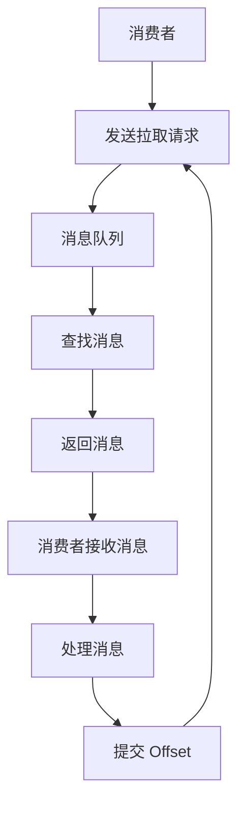
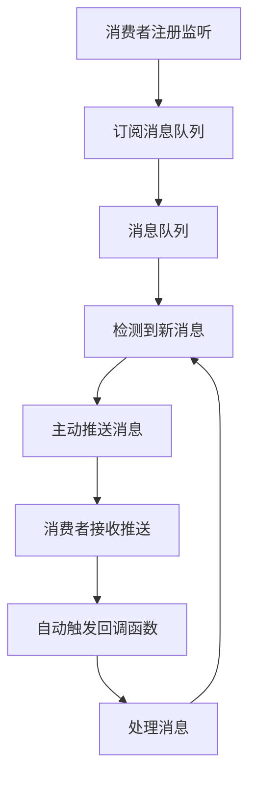
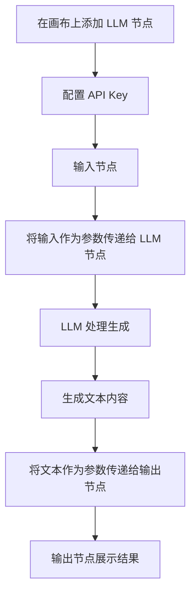

# 消息队列拉模式工作流程

```mermaid
graph TB
    A[消费者] --> B[发送拉取请求]
    B --> C[消息队列]
    C --> D[查找消息]
    D --> E[返回消息]
    E --> F[消费者接收消息]
    F --> G[处理消息]
    G --> H[提交 Offset]
    H --> B
```

## 消息队列推模式工作流程

```mermaid
graph TB
    A[消费者注册监听] --> B[订阅消息队列]
    B --> C[消息队列]
    C --> D[检测到新消息]
    D --> E[主动推送消息]
    E --> F[消费者接收推送]
    F --> G[自动触发回调函数]
    G --> H[处理消息]
    H --> D
```

## LLM 节点工作流程

```mermaid
graph TB
    A[在画布上添加 LLM 节点] --> B[配置 API Key]
    B --> C[输入节点]
    C --> D[将输入作为参数传递给 LLM 节点]
    D --> E[LLM 处理生成]
    E --> F[生成文本内容]
    F --> G[将文本作为参数传递给输出节点]
    G --> H[输出节点展示结果]
```
